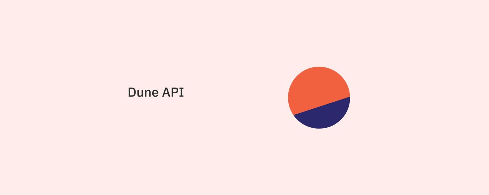

# Welcome to the Dune API

The Dune API gives you full access to the queries and data you can see on the Dune website. This means you can execute and read results from any public query, as well as any personal private queries your Dune account has access to.

This documentation describes all of the available API calls and properties of the returned objects. If you have any questions or feedback, please reach out to [api-feedback@dune.com](mailto:api-feedback@dune.com) or our #[dune-api](https://discord.com/channels/757637422384283659/1019910980634939433) Discord channel!

## How does the API work?

The API currently lets users:

1. Execute a query
2. Check the status of an execution
3. Get the results of an execution

These results are currently stored separately from anything you see on the Dune.com website. This means the only way to get query results from the Dune API is to execute a query using the Dune API.

Similarly, results from API executions are not currently reflected on Dune’s website.

## API Getting Started

### Obtaining an API Key
After purchasing an an app plan and API package, you can find the API key in your [settings page](https://dune.com/settings/api)) 

### Picking a Programming Language
While you can consume our API in the language of your choice - see the [API Reference](api-reference/authentication.md) section - we currently have quick start guides for [Python](quick-start/api-py.md) and [Node.js](quick-start/api-js.md).

## Important Links
 - API Documentation - you're already here, check out the sidebar to learn more!
 - [#dune-api Discord Channel](https://discord.com/channels/757637422384283659/1019910980634939433)
 - [API Client (Community Sourced)](../api/quick-start/community-clients.md)
