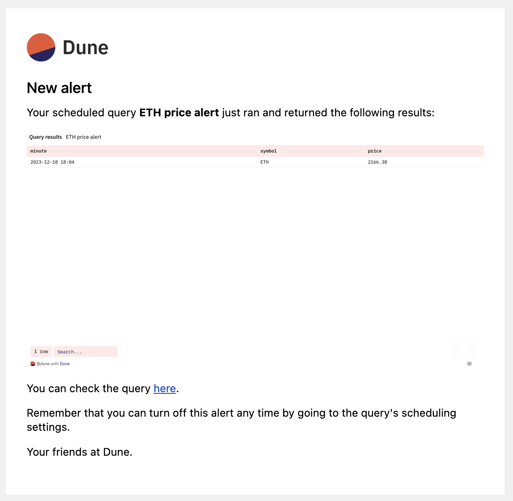
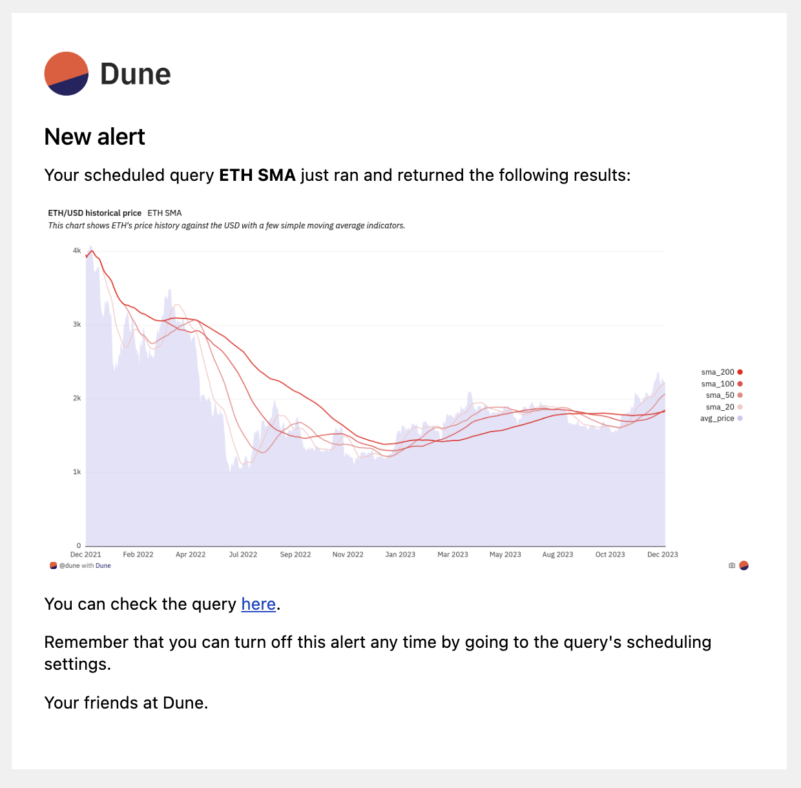
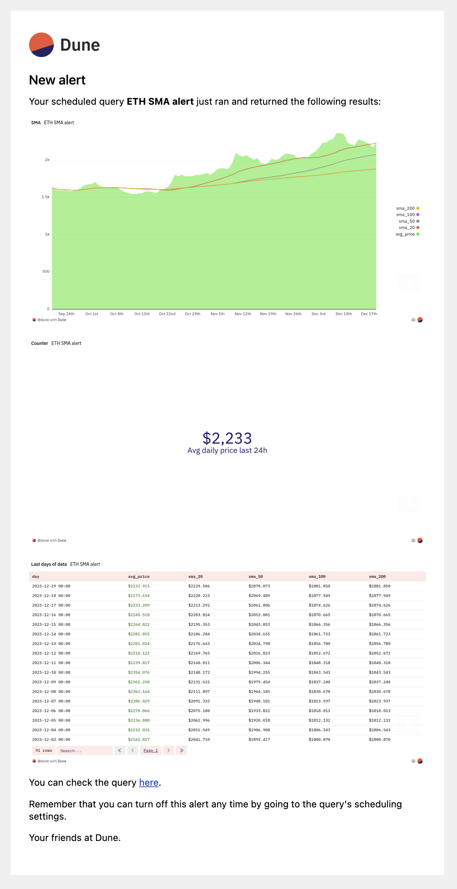
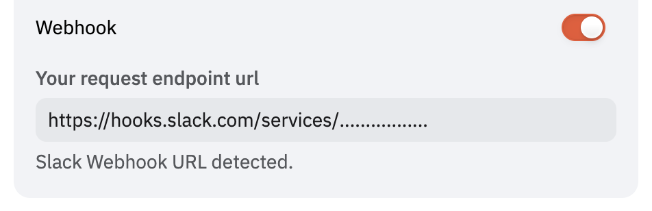
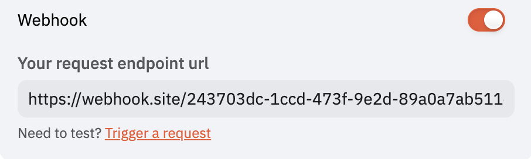
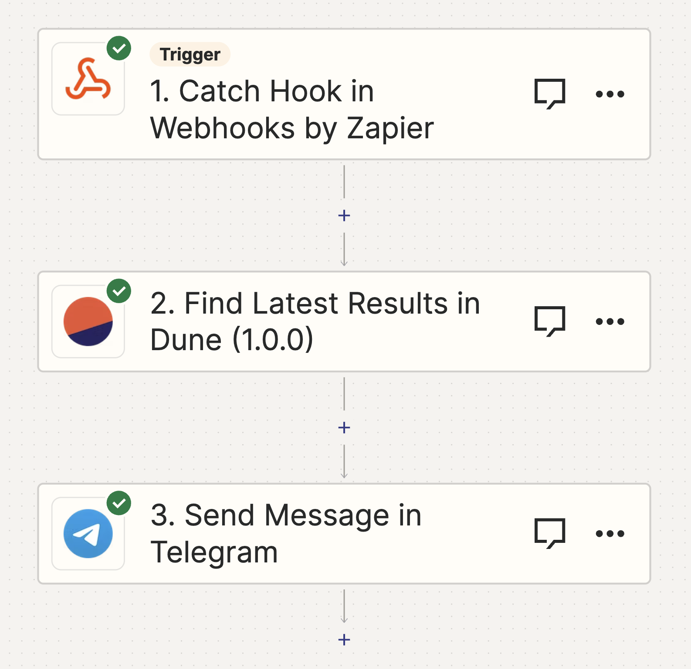

**Alerts allow you to receive notifications based on any query!**

Alerts allows users to set notifications for a scheduled query. These notifications are triggered each time the query runs. Supported delivery methods include:

- **Email:** Multiple email addresses can be added.
- **Webhooks:** Alerts can be sent to a specified callback URL, including Slack.

## Setup

### Accessing Alerts

<div style="position: relative; padding-bottom: calc(61.25000000000001% + 41px); height: 0;"><iframe src="https://demo.arcade.software/6IfAf55RjoFQ5OCax9Zj?embed" frameborder="0" loading="lazy" webkitallowfullscreen mozallowfullscreen allowfullscreen style="position: absolute; top: 0; left: 0; width: 100%; height: 100%;color-scheme: light;"></iframe></div>

To use Alerts, follow these steps:

1. Open a saved query that you own.
2. Click the "Schedule" button.
3. Configure the query schedule.
4. Activate the Alerts option.
5. Configure the alert delivery method.
6. Save the schedule.
7. Every time the query runs, the alert will be triggered. 


### Alert Timing

Alerts are triggered after query execution. Delays may occur due to factors like query complexity or system queues. Note that retry mechanisms for failed deliveries are not yet implemented. 

!!! warning
    
    Alerts are not recommended for time-sensitive or critical applications at this stage.


## Alert Content

### Email Alerts

Email alerts include screenshots of the visualizations you have defined. If you have defined no visualizations, we include a screenshot of the query results by default. Here's an example:



If you have defined a visualization, we will include it instead of the table, like this:




If your query contains multiple visualizations, or table visualizations (outside the default "Query results" table), they will all be included, such as here:



### Webhook Alerts

Webhook alerts adhere to the following schema:

```jsx
{
  message: string,
  query_result: {
    execution_id: string;
    query_id: number;
    state: string;
    submitted_at: string;
    expires_at: string;
    execution_started_at: string;
    execution_ended_at: string;
    result: {
      data_uri: string;
      metadata: {
        column_names: string[];
        result_set_bytes: number;
        total_row_count: number;
        datapoint_count: number;
        pending_time_millis: number;
        execution_time_millis: number;
      };
    };
  },
  visualizations: [
    {
      title: string;
      image_url: string;
    }
  ]
}
```

Here is an example corresponding to the last email example shared earlier:

```
{
  "message": "Query ETH SMA alert was submitted for execution at Wed, 13 Dec 2023 13:42:40 GMT by your query schedule and it was successfully executed with a non empty result.\nYou can check its latest result here: https://dune.com/queries/3137182?utm_source=webhook&utm_campaign=alerts",
  "query_result": {
    "execution_id": "01HHHPMKG6NBY0B04A36TS3AQH",
    "query_id": 3137182,
    "state": "QUERY_STATE_COMPLETED",
    "submitted_at": "2023-12-13T13:42:40Z",
    "expires_at": "2024-03-12T13:42:48Z",
    "execution_started_at": "2023-12-13T13:42:40Z",
    "execution_ended_at": "2023-12-13T13:42:48Z",
    "result": {
      "data_uri": "https://api.dune.com/api/v1/execution/01HHHPMKG6NBY0B04A36TS3AQH/results",
      "metadata": {
        "column_names": [
          "day",
          "avg_price",
          "sma_20",
          "sma_50",
          "sma_100",
          "sma_200"
        ],
        "result_set_bytes": 10710,
        "total_row_count": 91,
        "datapoint_count": 546,
        "pending_time_millis": 13,
        "execution_time_millis": 8038
      }
    }
  },
  "visualizations": [
    {
      "title": "SMA",
      "image_url": "https://prod-dune-media.s3.eu-west-1.amazonaws.com/screenshots/3137182/01HHHPMKG6NBY0B04A36TS3AQH/5232261.png"
    },
    {
      "title": "Counter",
      "image_url": "https://prod-dune-media.s3.eu-west-1.amazonaws.com/screenshots/3137182/01HHHPMKG6NBY0B04A36TS3AQH/5451006.png"
    },
    {
      "title": "Last days of data",
      "image_url": "https://prod-dune-media.s3.eu-west-1.amazonaws.com/screenshots/3137182/01HHHPMKG6NBY0B04A36TS3AQH/5451008.png"
    }
  ]
}
```

Validation of the webhook format can be done at [Webhook.site](https://webhook.site/). You can easily test it out by triggering manual deliveries by clicking the Manual trigger link below the URL field.

## Integration with Third-Party Apps

### Slack Support via Webhook

Following these simple steps you have get query results posted directly in Slack at your desired frequency.

1. Click Create `Create New App` on your [Slack app page](https://api.slack.com/apps).
2. Choose `From scratch` and give your alert a name, pick the workspace and click `Create App`
3.  Then click "Incoming Webhooks" and activate with the top right toggle.
4. Click `Add New Webhook to Workspace` at the bottom of the page. 
5. Select the Slack channel you want the alert to go to.
6. Copy the Slack Webhook URL and paste it into the Dune Alert configuration.
7. The help text below the field should indicate that a Slack URL has been detected:



Once saved, you will start receiving messages on Slack. Here is an example of how it looks:


### Zapier Integration

[Zapier](https://zapier.com/) is a third party solution that supports building integrations betwen different software solutions without writing any code. With it you can build advanced workflows that relay data between Dune and your favorite work tools.

We currently offer an experimental [Zapier app](https://zapier.com/developer/public-invite/194504/2174c6b998748b657f28dab4097f3e80/) to support connecting Dune with thousands of other tools via Zapier. 

To set it up, follow these steps:

1. Accept the invite to use our private Zapier app via [this link](https://zapier.com/developer/public-invite/194504/2174c6b998748b657f28dab4097f3e80/).
2. Create a new zap, with a [Webhook trigger](https://zapier.com/apps/webhook/integrations).
3. Copy the webhook URL provided by Zapier's Webhook trigger, and paste it in the Dune webhook URL field.
4. Now, on Zapier you can click Test to test that the webhook works.
5. Trigger a manual hook request from the Alerts configuration form to test it out, and it should show up on Zapier.
    1. If you want to relay screenshots to other tools, the screenshots will be in the payload.
    2. If you want to relay query results, the Dune Zapier App includes an action to fetch a query's latest results by query id, which will allow you to easily fetch query results.

This is where you can trigger manual hook deliveries:



Your setup on Zapier should look something like this:



## Known Issues and Solutions

1. **Manual Alert Triggering:** Currently, manual triggering is only available for webhooks.

    1. We're planning to add it to Email and Slack. In the meantime, you can set your query on a 15-minute schedule for quicker testing.

2. **No results in webhook:** Instead of including query results in the callback, the webhook payload includes a URL to fetch the query's results in case you need to action on them.

    1. We do not include datapoints in the hook callback in order to prevent unwanted credit spend on data exports.
    2. We're open to feedback on changing this behavior. If you have thoughts, let us know.
