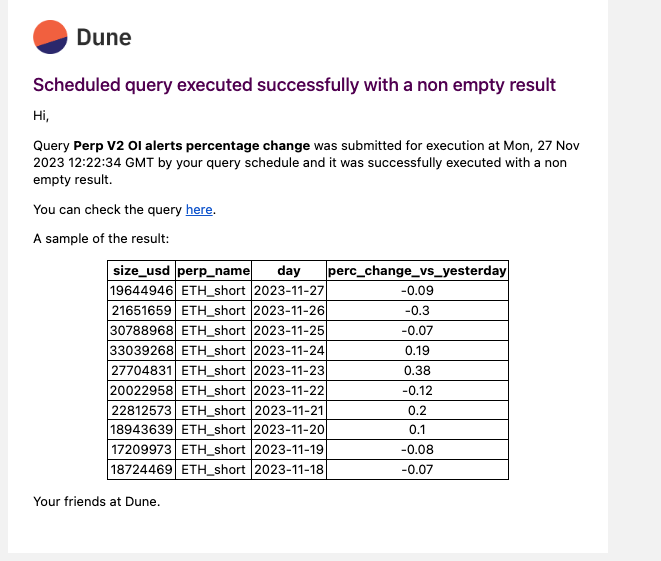

**Alerts allow you to receive notifications based on any query!**

Alerts allows users to set notifications for a scheduled query. These notifications are triggered each time the query runs. Supported delivery methods include:

- **Email:** Multiple email addresses can be added.
- **Webhooks:** Alerts can be sent to a specified callback URL.

## Setup

### Accessing Alerts

<div style="position: relative; padding-bottom: calc(61.25000000000001% + 41px); height: 0;"><iframe src="https://demo.arcade.software/6IfAf55RjoFQ5OCax9Zj?embed" frameborder="0" loading="lazy" webkitallowfullscreen mozallowfullscreen allowfullscreen style="position: absolute; top: 0; left: 0; width: 100%; height: 100%;color-scheme: light;"></iframe></div>

To use Alerts, follow these steps:

1. Open a saved query that you own.
2. Click the "Schedule" button.
3. Configure the query schedule.
4. Activate the Alerts option.
5. Configure the alert delivery method.
6. Save the schedule.
7. Every time the query runs, the alert will be triggered. 


### Alert Timing

Alerts are triggered after query execution. Delays may occur due to factors like query complexity or system queues. Note that retry mechanisms for failed deliveries are not yet implemented. Alerts are not recommended for time-sensitive or critical applications at this stage.

## Alert Content

### Email Alerts

Email alerts currently include a raw HTML table of truncated results and a link to the query. Future updates will replace the HTML table with a screenshot of the Dune table.

The Email will look like this:



The HTML table will include the raw results of the query, none of the formatting or styling from the Dune table will be included. Therefore, it is recommended to use ``cast``, ``format`` and ``round`` functions to format the data in the query.

### Webhook Alerts

Webhook alerts adhere to the following schema:

```jsx
{
  message: string,
  query_result: {
    execution_id: string;
    query_id: number;
    state: string;
    submitted_at: string;
    expires_at: string;
    execution_started_at: string;
    execution_ended_at: string;
    result: {
      data_uri: string;
      metadata: {
        column_names: string[];
        result_set_bytes: number;
        total_row_count: number;
        datapoint_count: number;
        pending_time_millis: number;
        execution_time_millis: number;
      };
    };
  }
}
```

Validation of webhook format can be done at [Webhook.site](https://webhook.site/).

## Integration with Third-Party Apps

### Slack Integration

Slack integration is possible through the webhook alert type. Users should:

1. Create a Slack app and activate "Incoming Webhooks."
2. Paste the Slack URL into the Alert configuration. [insert image]

### Zapier Integration

Direct integration with Zapier is not available. A workaround involves:

1. Setting up a Zapier webhook trigger.
2. Using the provided webhook URL as the Alert’s webhook.
3. Employing a specific [Dune zap](https://zapier.com/developer/public-invite/194504/2174c6b998748b657f28dab4097f3e80/) for interfacing with Dune. [insert image]

## Known Issues and Solutions

1. **Email Table Readability:** The HTML table is currently difficult to read.
   - **Workaround:** Use the link in the email to view the query.
2. **Manual Alert Triggering:** Currently, manual triggering is not available.
   - **Workaround:** Set a 15-minute schedule for quicker testing.
3. **Pagination in Webhooks:** No pagination support, which might affect data quota.
   - **Workaround:** Use queries with smaller result sets for testing.
4. **Visualizations:** Currently limited to Slack messages.
   - **Future Update:** Include in webhooks and emails, including private content.

## Feedback

Feedback can be provided through the Alerts Beta Telegram channel.

[Join the channel](https://t.me/+bt5J1QlJ3_FhMDU0)

## Acknowledgement

Thank you for participating in our beta testing program. Your feedback is essential for improving this feature.

---
