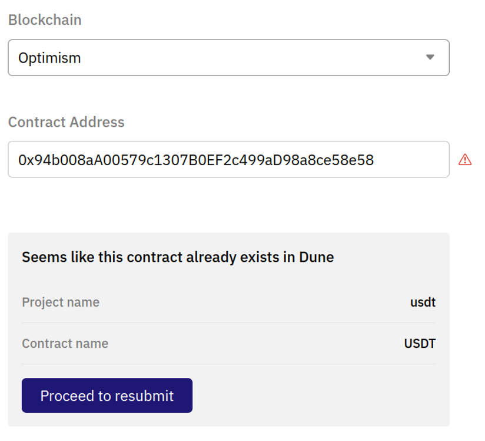

# Decoding Contracts
**Dune’s extensive catalog of decoded smart contracts are driven by our Wizards. Our decoding process empowers our community to submit the data and build the tables that they’d like to query on Dune!**

But what does decoding mean? Blockchain transaction data starts as bytecode, a low level programming language that can be read by machines. Using the ABI (Application Binary Interface) that is personal to each contract, we translate that bytecode into query-able data tables.

## A. The Lifecycle of Decoding

### Step 1: Submission

Our decoding process begins with our [contract submission page](https://dune.com/contracts/new).

To successfully submit a contract, you will need four pieces of information:

1. **Blockchain**: The name of the origin blockchain of the contract
2. **Contract Address**: The address associated with contract
3. **Project Name**: The name of the project that the contract originates from (ex. Tether) 
4. **Contract Name**: The name of the smart contract as given by the Project (ex. USDT)
5. **ABI**: Unique to each smart contract. Further details can be found [here](https://docs.soliditylang.org/en/latest/abi-spec.html). Note that for contracts that are verified by a chain's explorer we will attempt to auto-fetch the ABI. Otherwise the ABI will need to be entered manually.         

In most cases, the contract name will be pulled directly from a blockchain scanner. We recommend using the name provided. If the name is not automatically provided, please follow our naming conventions to assure the contract is properly assimilated into Dune’s database.

#### When do you need Advanced Options?

**Are there several instances of this contract?**

Contract “instances” are essentially contracts that are on the same chain and have the same bytecode (and therefore the same ABI). If you toggle instances to “Yes”, Dune can decode all instances without multiple submissions. 

**Is it created by a factory contract?**

A factory contract is essentially a smart contract that creates other smart contracts. If there are multiple contract instances, there is a chance that it is due to a factory contract. If you toggle this question to “yes”, Dune can decode all contracts created by the same factory that use the same ABI, and store them in the same table (ex., pools from Uniswap V3). 

#### Other Special Contracts

Other special smart contracts can be decoded as well, following these conventions: 

Proxy contract: Submit using the proxy address but the ABI of the implementation

Diamond proxy contracts: Submit all the facets using just the same name for the project and contract and upload all the relevant ABIs. This can be done with one ABI representing all facets or separate ABIs for each facet.

!!! suggestion "Where can I find this information?"
    Contract addresses can usually be found in a project’s docs. Once you have the contract address, you can use a blockchain explorer to get the rest of the information. Most blockchain explorers have everything you need!

!!! suggestion "What to know about Re-submissions"
    Given the popularity of some smart contracts, re-submissions happen. If the contract you are trying to submit already exists, an error like the following will pop up.
    
    
    There are some circumstances under which a contract can be resubmitted, like if the contract needs to be renamed. In that case, you can click **“Proceed to Resubmit”** and follow the steps to submit the contract as normal with one caveat: at the end of the submission process, you will be asked to explain why you want to resubmit the contract. Give as much detail as possible to avoid the resubmission being rejected! 

### Step 2: Decoding

Once the contract has been approved for decoding, you will receive a notification in your email. While the table itself may be visible after approval, it may be empty. No reason to worry! Note that it takes around 6 hours from the time the contract has been approved to be fully decoded and incorporated into the Dune database. 

At any point you can check the status of your submitted contract under "Contracts" in your settings. 

### Step 3: Finding Your Decoded Contract

One quick tip to find and begin querying your decoded table is to use Dune's Explorer. When beginning a new query, the Explorer is located to the left side of the Query Editor. From there, follow simple steps:

1. Drop the contract address of your decoded contract in the search bar
2. Pull up the specific function or event you are looking for
3.  use the **>>** button to immediately populate that table in your Query Editor. 

Then it’s all ready for you to query. Let the data flow! 

## B. Frequently Asked Questions

??? "On which chains does this work?"
    Any contracts created on blockchains that Dune has integrated. To check which blockchains we currently have available, see our section on [Tables and Chains](../index.md).

??? "How do I figure out if my contract has been decoded?"
    There are two main ways to find out if your contract has been decoded. 

    First: Account Settings

    Information on submitted contracts can be found in your account settings under “Contracts”. The status of the contract will reflect one of the following: 

    1. Pending
    2. Approved/Rejected*

    Note that once a contract has been approved, it takes around 6 hours for the data to be fully decoded and populated into our database.
    
    *If the contract is rejected, hover your mouse over the status to see the reason for the rejection. 

    Second: Our [Contract Decoding Dashboard](https://dune.com/dune/is-my-contract-decoded-yet-v2)
    
    
    Built by our decoding team, this dashboard gives you information on the status of any submitted contract. Input the contract address in the box at the top of the dashboard and if the contract has been decoded, the contract information will populate the box along with where it is located in the Dune database. 

??? "I see data on Dune but it doesn’t match or is missing what I expected to see." 

    Unfortunately, Dune only has access to contract data in circumstances that the contract performed an event that left a trace. Our recommendation is to check out the {blockchain}.traces table to see what information is available for a particular contract.
    
    Alternatively, some contracts are upgradeable (ie., the smart contract code can be modified). In this case we may not have all of the ABIs. ABIs can be checked in the ABI column of the {blockchain}.contracts tables. A contract can always be resubmitted with missing ABIs so we can update our data. 

??? "How do I submit contract information manually?"

    !!! note
        If the contract being manually submitted is a Proxy contract, we recommend you to move on to the next section.

    Although we try to fetch contract information such as the ABI, sometimes this information might not be available through our sources.

    In those instances, you will need to manually input the contract's name and its ABI.

    If the contract has been verified by the chain's block explorer, you should be able to find this information there.

??? "How do I submit a proxy contract?"

    In order to properly decode transactions for contracts that fit the [Proxy pattern](https://blog.openzeppelin.com/proxy-patterns/), Dune needs to map the Proxy contract's address with the implementation contract's ABI.

    We avoid monitoring the implementation contract's address because its logic is accessed in transactions via the [`DelegateCall` function](https://medium.com/coinmonks/delegatecall-calling-another-contract-function-in-solidity-b579f804178c).

    If we did monitor the implementation contract's address directly, we would miss out on any event logs in its logic since these are actually fired by the caller (the Proxy in this case) when calling a function through `DelegateCall`.

    !!! warning
     When submitting Proxy-patterned contracts to Dune, you should input the Proxy contract's address and, if you have it, the Implementation contract's ABI. If the Proxy has a new implementation upgraded that you wish to decode, use the same project name + contract name and select <b>'NO'</b> for several instances!

    

    When you submit the Proxy contract's address, we'll attempt to fetch the proxy's contract name and the implementation address it's pointing towards to source the Implementation contract's ABI.

    If we can't find the Implementation contract's ABI, you'll need to find it using the relevant chain's blockchain explorer and input it manually.

??? "How do I submit Diamond Proxy contracts?"

    Similar to vanilla Proxy contracts, [EIP-2535](https://eips.ethereum.org/EIPS/eip-2535) contracts can be supported by passing in the address of the Diamond Proxy as well as **a single ABI representing the totality of all the facets interfaces**.

??? "My submission got rejected, why?"

    The most common reason that your submission got rejected is because it has already been decoded! You can make use of [this dashboard](https://dune.com/dune/is-my-contract-decoded-yet-v2) to check whether the contract have been decoded.

    **Enter the contract that you wish to decode and hit enter to run:**

    

    **Viewing results:**

    

    If you see results after running the query, that means the contract is already decoded! You'll be able to find the decoded tables under 'Decoded Projects' in the data explorer.
    
    In the interest of data quality, we reject duplicative, incorrect or low quality submissions. To avoid rejection, be sure to submit accurate contract information! Submissions can be rejected for a number of reasons, including not following the naming conventions, not providing clear data at submission, etc. The particular reason for a contract submission being rejected can be found in account settings under “Contracts” by hovering the mouse over the “Rejected” status. 

??? "Why am I missing historical data for my contract?"

    It may take <b>up to six hours</b> from the time of contract approval for the contract to be fully decoded along with its historical data. If you still can't see the data after this period, please reach out to us through our [#decoding Discord channel](https://discord.com/channels/757637422384283659/850326962152538122).

??? "I'm waiting for my data to fully decode. What can I do in the meantime?"

    Need some data urgently but the contract have yet to be fully decoded? You can refer to these queries that utilizes the logs table to get the events:

    - [Querying Synthetix's PerpsTracking Event](https://dune.com/queries/2743182){:target="_blank"}
    - [Querying USDT's AddedBlackList Event](https://dune.com/queries/3250843){:target="_blank"}

### Additional Questions?
Head over to the [#decoding Discord channel](https://discord.com/channels/757637422384283659/850326962152538122) and we'll be happy to help!
