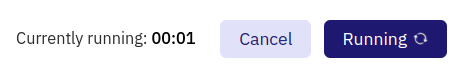

The Query Results section is where you can see the data your Query returns after you run it.

To get the results of your Query the first time, smash that Run button in the orange box below the Query Window:

After a short time, your Query Results will appear 🪄 as a table:

!!! warning
    Queries run on the database you've currently selected in the Data Explorer dropdown. EG if you run a Query that uses Dune V1 Ethereum data, it will fail to run if you select another V1 Blockchain dataset or Dune V2:
    
    

Above your Results table you'll find:
  
  1. The "Query Results" tab; if you make more Visualizations they'll appear as tabs next to this one.
  2. The New Visualization button which lets you make [Visualizations](../../getting-started/visualizations) out of your Query data.
  3. "Last run" and "Last run took" times so you can know how fresh your Results data is as well as a reference point for how long it might take you to Run again (could be more or less time depending on how you've modified your Query).
  4. The Run button (to re-run your Query as you change it or to).

### Saving Your Query

After running your Query at least once, you'll see the Save button appear above the Query Window:

Click it to see a pop up that asks you to give your Query a name, with the option to make this Query private (*~if~* you're a [Dune Premium](../../reference/pricing.md) user):

After your first Save, above the Query Window you'll find:

1. The Star button which will let you see how many stars your Query has, and star it yourself.
2. The Embed button for you and others to embed this Query on other web pages.
3. The Fork button for you and others to create a copy of this Query to modify to your hearts content 💖 

Anytime you make further changes the Run button will become a Save and run button:

This does what you might expect (saves your changes and re-runs your Query).

### Re-Running Your Query

When you re-run your Query, your Results table will be blank until the new data is ready and loaded:

The Run button will change to show:

1. How long your Query has been running
2. A Cancel button (in case you're tired of waiting!)

### Formatting Results Tables

You can change the formatting and appearance of your Query Results tables with the options below the table. 

What do we have here? 👀

1. The Add to dashboard button which won't work until you've [saved your Query](#saving-your-query). Learn more about [making Dashboards here](../../getting-started/dashboards.md)
2. A field to change your table's Title.
3. Settings for each of your columns.

Column settings are pretty straightforward:

- Title let's you change the column's title
- Align lets you change the column data's text alignment
- Format lets you change how numbers are formatted, more on that just below 👇.
- Hide column removes the column from your table's display
- Colored positive values makes your column's positive values green.
- Colored negative values makes your column's negative values red.

Column number formatting follow this logic:

| Value        | Number format | Output          | Description                                                                                                                                           |
| ------------ | ----------- | --------------- | ----------------------------------------------------------------------------------------------------------------------------------------------------- |
| 1256784.3745 | left blank  | 1256784,3745000 | Display the full number and 7 decimals                                                                                                                |
| 1256784.3745 | 0           | 1256784         | Only Display whole numbers                                                                                                                            |
| 1256784.3745 | 0,0         | 1,256,784       | Only displays whole numbers with comma separator                                                                                                      |
| 1256784.3745 | 0,0.00      | 1,256,784.38    | Displays the value with decimals points according to the count of zeroes after the dot                                                                |
| 1256784.3745 | 0\[.]0a     | 1.2m            | 
Displays the value in an abbreviated format.

Will display decimals of the abbreviated number according to count of zeroes after the dot.
 |
| 1256784.3745 | $0\[.]0a    | $1.2m           | Adheres to the same methods as before, but adds a $ prefix.                                                                                           |

### Visualizations

To make Visualizations out of your Query Results, start by, you guessed it, smashing that New Visualization button (a normal click will also work if you really prefer).

Then check out our [Visualizations](../../getting-started/visualizations) docs to learn how to make 📊 magic!