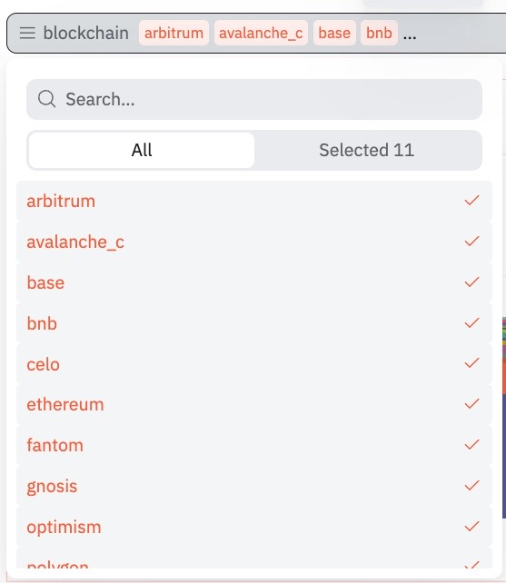

Parameters allow you to implement variables in certain parts of your Query. This is useful if you want to create a Query that you can reuse with different parameters.

Parameters in Dune are versatile and can be used in many different ways. You can use them to:

- filter on a specific token
- filter on a specific token pair
- filter on a specific address
- filter on a specific date range
- filter on a specific category
- etc.

Parameters can be a **single value** or a **list of values** and you can choose **one** or **multiple** values from a pre-defined list of values. This list can be manually defined or populated from a different query.


**To use parameters:**

1. choose the spot in your Query where you want to implement a parameter
2. click on the add parameter button or type ``{{example_parameter_name}}``
3. open the parameter options 
4. configure your parameter's name, type, and default value

Parameters can be text, numbers,a date, a manual list of values or a list of values from a different query.

<div style="position: relative; padding-bottom: calc(50.67708333333333% + 41px); height: 0;"><iframe src="https://demo.arcade.software/wEVEG2p4ns4oXV5LSpJ3?embed" title="Parameter demo" frameborder="0" loading="lazy" webkitallowfullscreen mozallowfullscreen allowfullscreen style="position: absolute; top: 0; left: 0; width: 100%; height: 100%;color-scheme: light;"></iframe></div>


### Freeform parameters

Freeform parameters are useful if you want your users to be able to input any text, number or date value. An example of this would be a parameter that allows users to input an address, a token, or a date.   
The system will automatically detect the type of the value and insert it into the query as the correct type. You can also manually adjust the type within the query by using the `cast` function.


For example:

``` sql
-- freeform varbinary parameter
Select * from ethereum.transactions
where "from" = {{address_parameter}}
```

```sql
-- freeform number parameter
Select * from dex.trades
where amount_usd > {{usd_amount_parameter}}
```

``` sql
-- freeform date parameter
Select * from dex.trades
where evt_block_time between cast('{{start_date_parameter}}' as timestamp) and cast('{{end_date_parameter}}' as timestamp)
```

### List parameters

List parameters are useful if you want your users to be able to choose **one** or **multiple values** from a pre-defined list of values. This list can be manually defined or populated from a different query.
Examples of this include parameters that allows users to choose from a list of tokens or a list of token pairs.



```sql
--- list parameter allowing single value
Select * from dex.trades
where token_pair = ({{token_pair_parameter}})
```

or

```sql
--- list parameter allowing with multiple values
Select * from dex.trades
where token in (Select token from unnest(split('{{token_list_parameter}}',',')) as c(token))
```

!!!info "multiple values"

    If you want to allow multiple values, you need to adjust your query for this. Use the `unnest` and `split` functions to turn the columns into useable values.
    By default, the values will be inserted into the query as individual columns.

    **Example**:   
    A list of 3 selected values in a parameter called `example_parameter_name` will be inserted into the query like this:
    ```sql
    Select {{example_parameter_name}} 
    /* returns 
    | column1   | column2   | column3   |
    | --------- | --------- | --------- |
    | WETH-USDC | WBTC-USDC | DAI-USDC  |
    */
    ``` 

    Most of the time, you'll want to use the values in a `where in` clause. To do this, you need to use the `unnest` and `split` functions to turn the columns into useable values.

    For example:

    ``` sql
    Select * from dex.trades
    where token_pair in (Select pair from unnest(split('{{example_parameter_name}}',',')) as c(pair))
    ```

#### Manual list

When you manually define a list of values, the list can be text values, numbers, dates or even varbinary values. The system attemtps to detect the type of the list values, but sometimes you might have to manually adjust the type within the query by using the `cast` function.

A very common example of using a manual list is setting the "time granularity" of a dashboard/query.

```sql
Select 
    date_trunc('{{time_granularity_parameter}}', evt_block_time) as time, 
    sum(amount_usd) as amount_usd
from dex.trades
group by 1
/* parameter options:
    - default value: day
    - list values: day, week, month
*/
```

#### List from query results

You can use the results of a query as the list of values for a parameter. Doing this allows you to build dynamic dashboards that allow users to choose from a list of values that is populated by a different query. You can choose any query by its query_id and any column by its name. The column data type will be transferred to the parameter.

<p align="center">
  <br />
  <em>Simply pick a query id and column name to populate your parameter list </em>
</p>


!!! info "Query results"

    The query that you use to populate the list of values does not update automatically. You need to trigger a refresh of the query results to update the list of values. This can happen by either manually refreshing the query results or by setting up a [query schedule](query-scheduler.md).

This feature can be used in all kinds of ways, but here are a few examples:

- to choose from a list of tokens
- to choose from a list of token pairs
- to choose from a list of addresses or labels
- to single out specific products or categories

All of these examples could be solved with a manual list, but using a query to populate the list of values allows you to build dynamic dashboards that update automatically. It also can simply make it easier to manage a list of values that is shared between multiple queries.

**Example 1:**   

You can use a distinct query on dex.trades to populate a list of all projects currently in dex.trades. This list can then be used in multiple queries. 
```sql
Select distinct project from dex.trades
```

[link to dashboard](https://dune.com/dune/query-result-parameter-showcase)


**Example 2:**

Filter on all available perpeptual futures available on synthetix. The master query for this is query_3256054. We can use this query to populate a list of all available perps:

```sql 
--query 3256054 constructs the daily open interest for all synthetix perps
Select 
    distinct perp_name 
from query_3256054 
order by perp_name
```

We can then use this list of perps in query_3256054 to make filtering on a specific perp possible:
```sql
...
and perp_name in (Select perp_name from unnest(split('{{perp_name}}',',')) as b(perp_name))
```

[link to query](https://dune.com/queries/3256054/)


### Parameters in dashboards

If you want to use the same parameter between different queries on a dashboard, make sure to use exactly the same settings for the parameter in each query. The parameter will then be shared between the queries and only turn up once in the dashboard's parameter menu. Exactly the same settings means:

- the parameter name is the same
- the parameter type is the same
- the parameter default value is the same
- the parameter list of values is the same
- the query id and column name for a list of values from a query is the same