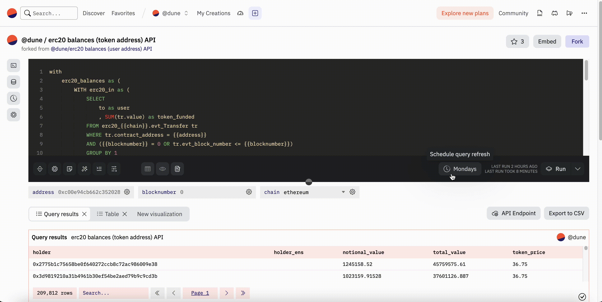

**Query Scheduling allows you to schedule a query to run at a specific time and frequency.**

Queries on Dune usually execute when a user triggers an automatic or interactive execution. This means that if you have a dashboard that is not frequently viewed, the data displayed on the dashboard may be outdated and execution of the queries will only be triggered once a user views the dashboard. Especially for dashboards that contain resource-intensive queries, this can lead to long loading times for the viewer.

To keep your dashboard up-to-date and to ensure that your queries are executed reliably and in a timely manner, you can schedule them to run at a specific time and frequency. Scheduled queries can be run on medium and large query engines, which will require credits. Credit costs are the same as any other query execution on Dune, you will pay 10 credits for a medium tier execution and 20 credits for a large tier execution.

### How to Schedule a Query

<iframe src="https://demo.arcade.software/HDqYf2VdwfwMdHFzKh6u?embed" frameborder="0" loading="lazy" webkitallowfullscreen mozallowfullscreen allowfullscreen style="position: absolute; top: 0; left: 0; width: 100%; height: 100%;color-scheme: light;" title="Query Scheduler V2"></iframe>

1. Start by clicking the scheduler (clock) icon located at the bottom of the query editor, to the left of the "Run" button
2. A dialog will prompt you to set a refresh schedule and an execution tier. Please note that scheduled queries can only be run on medium and large query engines, which will require credits.
3. The dialog will display an estimated monthly credit consumption for this query scheduling, along with a monthly quota. These values will adjust based on the frequency and execution tier you select.
4. Save the schedule
5. Your query will execute once to start the schedule, and then will execute according to the schedule you set.

!!! warning
    - Query scheduling is currently not available for queries with parameters.
    - The query schedule is removed when the queries are archived or when the ownership changes (e.g., when a query is migrated).
    - There are no notifications available for scheduled query failures as of now.
#### Adjusting or Cancelling a Query Schedule

If you need to modify or cancel a query schedule, click on the scheduler icon to open the scheduling dialog. Make changes as needed or click "Stop" to cancel the schedule.

### Why Schedule a Query? 

Scheduling queries are useful for two reasons:

1. **Increase the execution frequency of your queries**
2. **Guarantee that resource-intensive queries are executed reliably**

#### When does Dune execute queries? 
Before we dive into the details, let's first take a look at when queries are executed on Dune:

- **Interactive executions** are manually triggered by a user clicking the "Run" button in the query editor page or refreshing an entire dashboard. Interactive executions can be routed via the community, medium, or large cluster, depending on the query engine selected.  

- **Automatic executions** are triggered whenever any user on Dune encounters a widget on a dashboard and the widget's underlying query results are "expired". As of now, query results are set to expire every 6 hours, although this is subject to change. These automatic executions are always routed via the community cluster.

- **Scheduled executions** are triggered at a specific time and frequency. Scheduled executions can be routed via the medium or large cluster, depending on the execution tier selected.

#### 1. Increase the execution frequency of your queries

To bypass the usual 6-hour expiration time of query results, you can schedule your queries to run at a higher frequency. This will ensure that your dashboard displays the most up-to-date data. 

#### 2. Guarantee that resource-intensive queries are executed reliably

All automatic query executions are routed via the community cluster. This can lead to very long loading times for the viewer if the query is resource-intensive and the community cluster is busy. In the worst case, the query may even time out.

If you schedule your queries instead of relying on automatic executions, you can choose a higher execution tier, which will ensure that your queries are executed reliably and in a timely manner.

### Additional Info
➕ We plan to extend the functionality of query scheduling with webhooks, alerts, and the ability to update materialized views. We are also working on a allowing you to schedule a whole dashboard at once. Stay tuned for updates!

💭 Have an idea for additional features for scheduled queries? Please [submit them here](https://feedback.dune.com/)! We value your input and are regularly implementing improvements based on user feedback.
