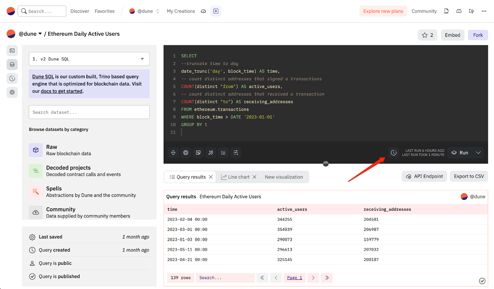
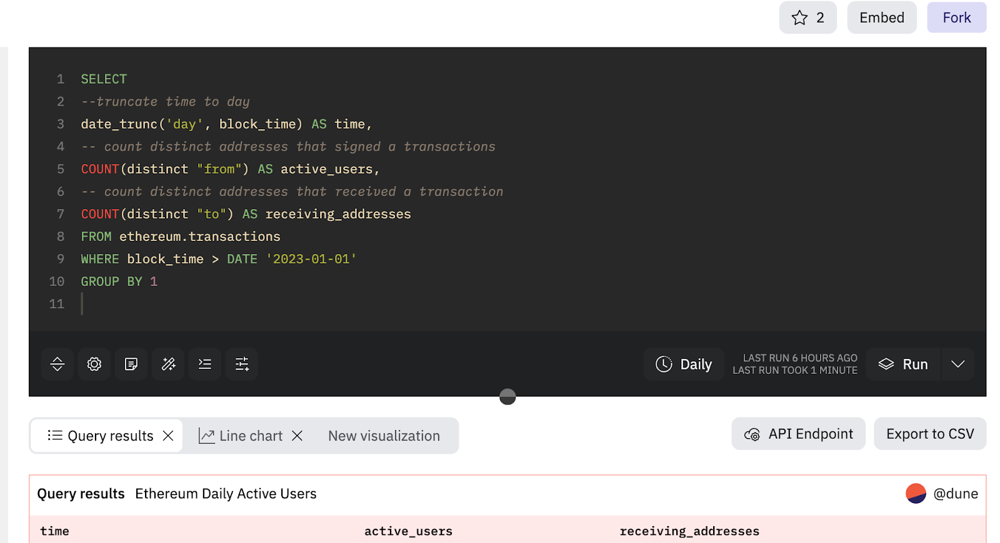

We have introduced a powerful new feature: Query Scheduling. It allows you to set your queries to run automatically according to a defined schedule, ensuring a more reliable and up-to-date dashboard display.

To schedule a query, simply **click the "clock" icon located at the bottom of the query editor, to the left of the "Run" button**.

!!!Note
    - Query scheduling is currently not available for queries with parameters.
    - The query schedule is removed when the queries are archived or when the ownership changes (e.g., when a query is migrated).
    - There are no notifications available for scheduled query failures as of now.

### Why Schedule a Query? 

Query scheduling can dramatically increase the reliability of query execution and provide a more consistent dashboard display.

At Dune, we offer two types of query executions: Interactive and Automatic.

**Interactive executions** are manually triggered by a user clicking the "Run" button in the query editor page or the dashboard.

**Automatic executions**  on the other hand, are triggered 1/ when **any** user views a dashboard where a widget from a query is embedded and 2/ when the query result for the widget has expired. As of now, query results are set to expire every 6 hours, although this is subject to change. These automatic executions are always routed via the community cluster.

Since the community cluster can get quite busy, we cannot guarantee that all automatic query executions will finish within the given 30-minute query timeout limit.

Scheduling queries bypasses this issue by routing the query to either the medium or large cluster, ensuring reliable and predictable results for your dashboard or query.

### How to Schedule a Query
#### 1. Start Scheduling a Query

Start by clicking the scheduler (clock) icon located at the bottom of the query editor, to the left of the "Run" button

#### 2. Choose Frequency and Execution Tier

A dialog will prompt you to set a refresh schedule and an execution tier. Please note that scheduled queries can only be run on medium and large query engines, which **consume credits**.

##### Understand Credit Consumption
The dialog will display an estimated monthly credit consumption for this query scheduling, along with a monthly quota. These values will adjust based on the frequency and execution tier you select.

##### Options for Schedule Frequency:
The default schedule frequency is daily between 00:00-00:30.
1. **Minute**: Schedule the query to run every 15, 20, or 30 minutes.
2. **Hour**: Schedule the query to run every 1, 2, 3, 4, 6, 8, or 12 hours.
3. **Day**: Schedule the query to run every day during a specified 30-minute window (starting from 00:00).     
4. **Week**: Schedule the query to run on specific days of the week.

#### 3. Save the Scheduler

Once you click "Save", your query will run. Thereafter, it will trigger according to the schedule you've set. The scheduler frequency will be displayed next to the scheduler icon.
Your query will be run once you click "Save". Hereonafter the query run will be triggered accordingto the schedule you set. 

You can see the scheduler frequency next to the scheduler icon.

#### 4. Adjusting or Cancelling a Query Schedule

If you need to modify or cancel a query schedule, click on the scheduler (clock) icon to open the scheduling dialog. Make changes as needed or click "Stop" to cancel the schedule.

### Additional Info
➕ We plan to extend the functionality of query scheduling with webhooks, alerts, and the ability to update materialized views.

💭 Have an idea for additional features for scheduled queries? Please [submit them here](https://feedback.dune.com/)! We value your input and are regularly implementing improvements based on user
