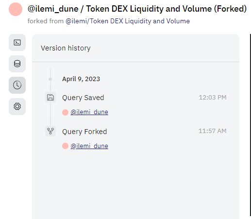
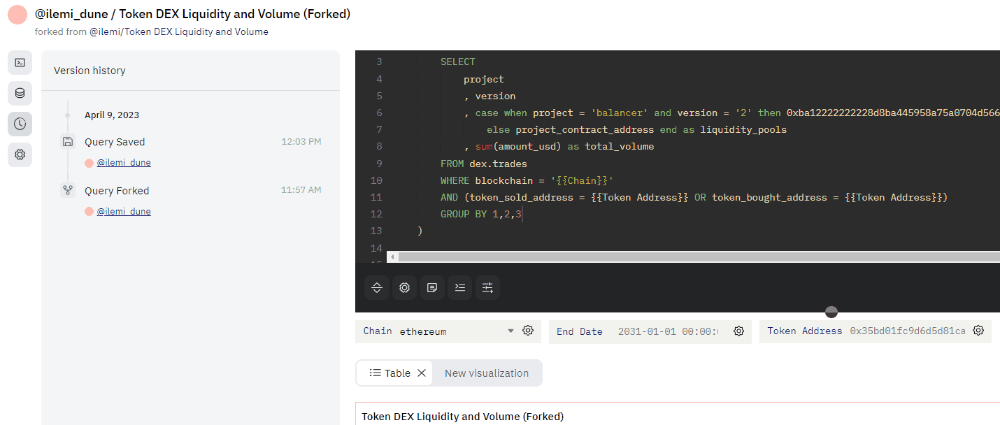
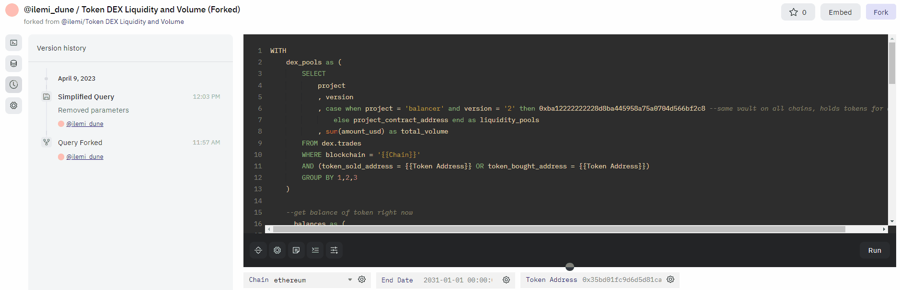

All queries now come with version history, where you can compare and revert to previous query versions seamlessly. **You can access version history by clicking the "clock" icon on the top left of the query editor.**

!!!History Length
    Everyone gets 30 days by default, you can upgrade your plan for longer history access. 

### Start of a new version

The first time you save a query (whether it is forked or freshly created), there will be an intial commit to the query history. If you've forked the query, you won't be able to access the original query's edit history - it starts anew for you.

### Saving and naming versions

You can save a new version at any time by running your query. If you leave the page without saving/running, the new version will be lost!

You can then edit the metadata of the saved version to make it easier to find in the future. 

### Comparing and reverting versions

Here's the main feature: you can now easily compare diffs with previous versions, and then revert if you want to. **The reverted query is saved as a new version in the query history.**

