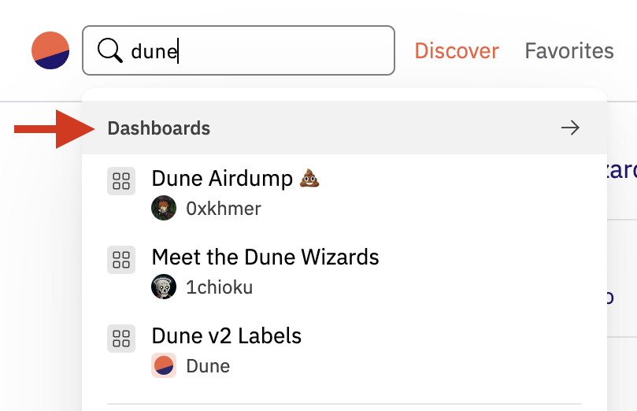
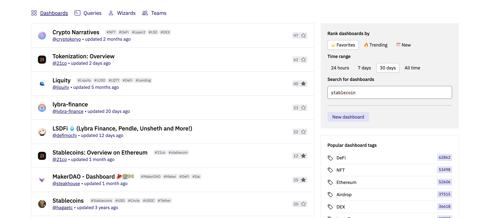

**Leverage Dune's powerful search functionality to find exactly what you need**

You can access Dune's search functionality everywhere in the Dune App through the search box in the top bar. If you want to refine your searches, you can click on the type of content you're interested in (e.g. Dashboards) to navigate to an extended results list:

## Refining your results

Alternatively, you can head over to the [Discover page](https://dune.com/browse/dashboards) where you will find the extended results page, with additonal filters to apply, such as ranking by trending, favorites or recently created. You will find your search input which you can edit alongside these filters to refine your search on the sidebar next to the results list:

You can edit your input and the results will immediately update to reflect. You can also rank by:

- Favorites, which combined with the time filter reflects the number of favorites received over that time period. This is useful to capture recently popular content.
- Trending, which is an internal metric of content popularity over the short term, across 3 different time windows.
- New, which ranks by the content's "created at" timestamp.

## Advanced Search

You can apply advanced filters to your search, in any of Dune's search fields (in the top bar or in the sidebar in Discover).

These are the filters we currently support:

| **Filter** | **Description** | **Example** |
| ----------------- | ------------- | ------------ |
| `title` | Search by title. Wrap your value in double quotes if your input has spaces. | `title:usdc` or `title:"dex tracker"` |
| `tags` | Search by tag or tags. | `tags:usdc` |
| `author` | Search by author. | `author:dune` |
| `description` | Only applicable to Queries, find matches in the description. | `description:usdc` |
| `created_before` | Only include matches created before or at a given date. | `created_before:2023-01-30` |
| `created_after` | Only include matches created after or at a given date. | `created_after:2023-01-30` |
| `updated_before` | Only include matches updated before or at a given date. | `updated_before:2023-01-30` |
| `updated_after` | Only include matches updated before or at a given date. | `updated_after:2023-01-30` |

Notes:
- You can combine multiple filters together with arbitrary text. 
- You can also combine multiple values by separating them with a comma.
- You can wrap your input in double quotes such as `stablecoins tags:usdc,usdt`

!!! note
    
    Advanced Search is currently only supported for Dashboards and Queries.

## Code search

For queries, you can tick the *Search code* box to find relevant queries whose SQL code matches your input. Use it to find examples of queries that query a specific table, namespace or queries using a particular kind of SQL operation or syntax.