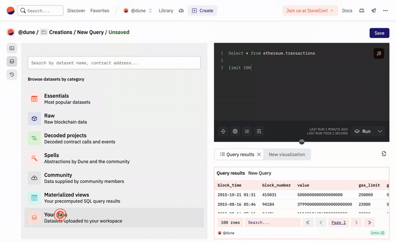

**Easily upload your own data to Dune**

This feature allows you to upload any csv file to Dune and query it like any other table in Dune. Currently, the we only supports uploading CSV files with a maximum size of 200 MB. The app will return an error if the file size exceeds this limit.   
Additionally, column names in the table can't start with a special character or digits.

The files you upload will be queryable via the schema ``dune.team_name.dataset_name``. For example, if you upload a file called ``energy_data.csv`` to the team ``dune`` and name the dataset ``energy_data``, you will be able to query the data via ``dune.dune.energy_data``.

You'll be able to query for your data in any query.

```sql
Select * from dune.dune.dataset_energy_data
```

We automatically infer schemas (=detect datatypes) for all uploaded data. If in doubt, you can check the assumed datatypes in the information schema. 

```sql
SELECT * FROM information_schema.columns 
WHERE table_schema = 'dune' -- replace with your team name
AND table_name = 'energy_data'; -- replace with your dataset name
```

Anything that represents a timestamp is especially tricky for automated systems to detect, if something is not working as intended, try coverting the timestamp to ISO time before uploading and use the [applicable DuneSQL function](../query/DuneSQL-reference/Functions-and-operators/datetime.md#from_iso8601_timestamp) to convert it back. This will not automatically convert the datatype, but it will allow you to easily query the data as a timestamp.


!!! Info
    All data uploaded is public and can be accessed by anyone.   
    Private data uploads are available only on the **premium plan.**


!!! Tip
    You can also upload data via the API. Check out the [API documentation](../api/api-reference/upload-data/index.md) for more information.


<div style="position: relative; padding-bottom: calc(54.166666666666664% + 41px); height: 0; width: 100%"><iframe src="https://demo.arcade.software/ZfmeSKYxCY7cTfcv6cDW?embed" frameborder="0" loading="lazy" webkitallowfullscreen mozallowfullscreen allowfullscreen style="position: absolute; top: 0; left: 0; width: 100%; height: 100%;color-scheme: light;" title="Dashboards"></iframe></div>

1. Click on the "Upload Data" button in the menu of the Dune UI.
2. Select the csv file you want to upload.
3. Name your table and add a description.
4. Click on save to finish the upload.


## Querying for the data in Dune

Once the data has been uploaded, you can explore it in the my data section in the data explorer: 



You can query for your data in any query.

```sql
Select * from dune.dune.dataset_energy_data
```

To check whether the datatypes are correctly inferred, you can use the following query:

```sql
SELECT * FROM information_schema.columns 
WHERE table_schema = 'dune' -- replace with your team name
AND table_name = 'energy_data'; -- replace with your dataset name
```

## Updating data

Currently there is no way to update the data of an already existing .csv file.

However, you can use the "query a query" feature to query multiple .csv files at once.

For example:

```sql
--query_2441513

Select * from dune.dune.dataset_energy_data_1

UNION ALL

Select * from dune.dune.dataset_energy_data_2

-- add more as it becomes relevant
```

In your main query, you could then simply refer to this query.

```sql
Select * from ethereum.transactions t
left join query_2441513 q on q.address = t."from"
```

## Private data

If you don't want to share your data with the world, you can also upload private data. Private data is only visible to you and your team members.

To upload private data, **you need to be on the premium plan**. If you are on the premium plan, you can upload private data by toggling the "make table private" switch in the upload data modal.

You can also change the privacy settings of a dataset after it has been uploaded. To do so, go to settings -> data page and click on the three dots next to the dataset you want to change the privacy settings for. Then click on "make table private" to make the table private or "make table public" to make it public. 

## Deleting data

You can delete your data via your settings page.

<div style="position: relative; padding-bottom: calc(61.25000000000001% + 41px); height: 0; width: 100%"><iframe src="https://demo.arcade.software/mr3mDEQl0qQi9e1H4HZB?embed" frameborder="0" loading="lazy" webkitallowfullscreen mozallowfullscreen allowfullscreen style="position: absolute; top: 0; left: 0; width: 100%; height: 100%;color-scheme: light;" title="Teams > Dune"></iframe></div>to my @R1971 

1. Click on the "settings" button in the menu of the Dune UI.
2. Click on "data".
3. Find the dataset you want to delete.
4. Click on the three dots to open the options for the dataset.
5. Click on "delete dataset".
6. confirm the deletion.
7. The dataset is now deleted.


## Large Amounts of Data

If you want to share valueable off-chain data on Dune with your community, we are happy to discuss custom arrangements. Please reach indicate your interest via this [form](https://bit.ly/dune-data-integration).@R1971 to my

This is only applicable for datasets with positive externalities for the Dune community. Examples include:

- [Farcaster](../data-tables/community/neynar/farcaster/index.md)
- [Reservoir](../data-tables/community/reservoir/index.md)
- [Flashbots](../data-tables/community/flashbots/index.md)


