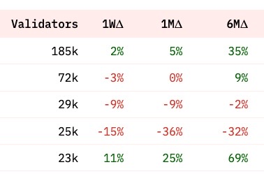

**Tables are the default Visualization whenever you create and run a Query.**

You can also make more Tables to display your data differently using the New visualization button and drop down menu:

### Configuring your Table

#### Table options

**Title**

The Title appears at the top of your Table.

Leaving default value (`Table`) or making this blank makes your Table title the same as your Query's title/name.

Adding any other value to this field will add that value first, followed by your Query Name:

Note: the default value for "Query Results" is treated like an added value.

#### "Column [x]:" options

You can configure the following options for each column in your Table

=== "Title"

    The Title appears at the top of your Table.

    Leaving this blank makes your column title the same as its Dune database name.

=== "Align"

    This changes the text alignment for the column data and title.

=== "Format"

    Allows you to adjust the numerical format of your data following the [X/Y-axis Tick and Label formats here](charts-graphs.md#xy-axis-tick-and-label-formats).

=== "Hide Column"

    Hides this column from your table.

***

#### Numerical Column options

Columns that return numerical data have these additional options:

=== "Type"

    - `Normal` simply displays the column's numerical data.
    - `Progress bar` shows the column's numerical data with a progress bar visual that is "full" for the column's highest value and "nearly empty" for the column's lowest value, with the rest of the data ranging in between:

    

=== "Colored Values"

    Check these boxes to color Positive Values Green and Negative Values Red.

    

