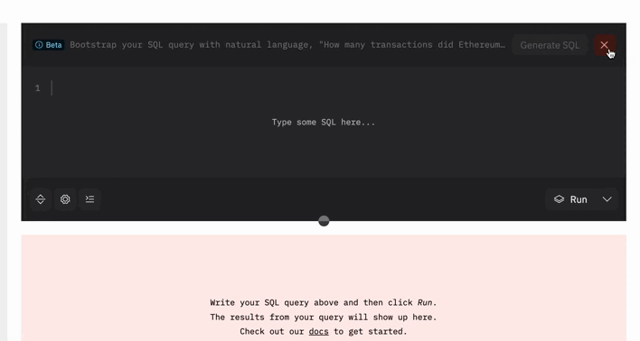

**Dune is launching a beta suite of tools for writing SQL queries with the help of large language models.**


### Wand Create
The Wand Create feature allows you to automatically generate SQL queries from natural language questions. It utilizes a suite of Dune-specific few-shot examples and automatically fetches table schemas to include in the prompt. (You must to explicitly include the relevant tables in your natural language question to include table schemas.) 

This feature simplifies the process of writing getting started writing a SQL query, especially for users who may not be familiar with the database structure. Your mileage may vary depending on the complexity of your question and how well the underlying tables are suited to answering it. We recommend using this feature as a starting point and then refining the query using the Wand Edit feature. 

You can find this feature in the query editor and click the wand logo in the top right corner to open the Wand bar. An empty query page should open in Create mode and you can toggle between Create and Edit modes using the buttons in the top right corner of the query editor.


### Wand Edit
The Wand Edit feature allows you to edit an existing SQL query based on a natural language question. Similar to query generation, any additional tables required should be explicitly included in the natural language edit request to make use of schemas. This feature simplifies the process of refining and fine-tuning SQL queries generated by the system or existing queries in your application.

You can find this feature in the query editor and click the wand logo in the top right corner to open the Wand bar. An non-empty query page should open in Edit mode and you can toggle between Create and Edit modes using the buttons in the top right corner of the query editor.


Below are some examples of use cases for the Wand Edit feature:

#### Adding statistics to a query

Add the remaining components of a five point summary.

Original query:
```sql 
    SELECT 
        date_trunc(\'day\', block_time) AS time
        , (PERCENTILE_CONT(0.5) WITHIN GROUP (ORDER BY gas_price))/1e9  AS median_gas
        , COUNT(*) AS daily_tx
    FROM ethereum.transactions
    GROUP BY time
```


Edited query:
```sql 
SELECT 
    date_trunc('day', block_time) AS time
    , MIN(gas_price)/1e9 AS min_gas
    , (PERCENTILE_CONT(0.25) WITHIN GROUP (ORDER BY gas_price))/1e9 AS lower_quartile_gas
    , (PERCENTILE_CONT(0.5) WITHIN GROUP (ORDER BY gas_price))/1e9  AS median_gas
    , (PERCENTILE_CONT(0.75) WITHIN GROUP (ORDER BY gas_price))/1e9 AS upper_quartile_gas
    , MAX(gas_price)/1e9 AS max_gas
    , COUNT(*) AS daily_tx
FROM ethereum.transactions
GROUP BY time
```

#### Adding a join to a query
Join nft.wash_trades to nft.trades to get the percentage of sellers who have been involved in wash trading.

Original query:
```sql 
SELECT  date_trunc('day', block_time) as day, COUNT(distinct seller) as sellers
FROM nft.trades
WHERE project = 'blur'
GROUP BY 1
```

Edited query:
```sql
SELECT  
    date_trunc('day', t.block_time) as day, 
    COUNT(distinct t.seller) as sellers, 
    COUNT(distinct wt.seller) as wash_traders, 
    (COUNT(distinct wt.seller) * 100.0 / COUNT(distinct t.seller)) as wash_traders_percentage
FROM 
    nft.trades t
LEFT JOIN 
    nft.wash_trades wt ON t.seller = wt.seller
WHERE 
    t.project = 'blur'
GROUP BY 
    1
```

#### Reformat Output
Return monthly volume with each year from 2023 to 2019 as a separate column

Original query:
```sql
SELECT
 DATE_TRUNC('month', block_time),
 SUM(CAST(amount_usd AS DOUBLE)) AS usd_volume
FROM
 dex.trades AS t
WHERE
block_time > CAST('2019-01-01' AS TIMESTAMP)
GROUP BY
 1
```

Edited query:
```sql
SELECT
  DATE_TRUNC('month', block_time) AS month,
  SUM(CASE WHEN EXTRACT(YEAR FROM block_time) = 2019 THEN CAST(amount_usd AS DOUBLE) ELSE 0 END) AS usd_volume_2019,
  SUM(CASE WHEN EXTRACT(YEAR FROM block_time) = 2020 THEN CAST(amount_usd AS DOUBLE) ELSE 0 END) AS usd_volume_2020,
  SUM(CASE WHEN EXTRACT(YEAR FROM block_time) = 2021 THEN CAST(amount_usd AS DOUBLE) ELSE 0 END) AS usd_volume_2021,
  SUM(CASE WHEN EXTRACT(YEAR FROM block_time) = 2022 THEN CAST(amount_usd AS DOUBLE) ELSE 0 END) AS usd_volume_2022,
  SUM(CASE WHEN EXTRACT(YEAR FROM block_time) = 2023 THEN CAST(amount_usd AS DOUBLE) ELSE 0 END) AS usd_volume_2023
FROM
  dex.trades AS t
WHERE
 block_time >= CAST('2019-01-01' AS TIMESTAMP)
GROUP BY
  1
```

#### Adding a CTE
Add a CTE to calculate the number of mints with nft.mints by day and then return the average number of mints per day and join it to the existing query

Original query:
```sql
select
 date_trunc('day', block_time) as dt
 ,count(hash) as num_transactions
 ,count(distinct "from") as users
 ,sum(gas_used) as gas_used
 ,avg(gas_used) as avg_gas_used
 ,avg(gas_price)/1e9 as avg_gas_price
from ethereum.transactions
where
 success
 and block_time >= cast('2022-01-01' as date)
 and date_trunc('day', block_time) < date_trunc('day', current_timestamp)
group by 1
```

Updated query:
```sql
WITH daily_mints AS (
    SELECT 
        date_trunc('day', block_time) as dt,
        count(*) as num_mints
    FROM nft.mints
    WHERE 
        block_time >= cast('2022-01-01' as date) 
        and date_trunc('day', block_time) < date_trunc('day', current_timestamp)
    GROUP BY 1
)

SELECT 
    et.dt,
    et.num_transactions,
    et.users,
    et.gas_used,
    et.avg_gas_used,
    et.avg_gas_price,
    dm.num_mints,
    avg(dm.num_mints) over () as avg_daily_mints
FROM (
    SELECT 
        date_trunc('day', block_time) as dt,
        count(hash) as num_transactions,
        count(distinct "from") as users,
        sum(gas_used) as gas_used,
        avg(gas_used) as avg_gas_used,
        avg(gas_price)/1e9 as avg_gas_price
    FROM ethereum.transactions
    WHERE 
        success
        and block_time >= cast('2022-01-01' as date) 
        and date_trunc('day', block_time) < date_trunc('day', current_timestamp)
    GROUP BY 1
) et
LEFT JOIN daily_mints dm ON et.dt = dm.dt
```

## Wand Debug
The Wand Debug feature helps fix SQL queries that have syntax errors. When an executed query encounters a syntax error, the Fix Query button should appear in the results/visualization panel. Clicking this button collect your query and the error message and send it to the Wand Debug feature. The Wand Debug feature will then attempt to fix the query and return the fixed query to you. If the Wand Debug feature is unable to fix the query, it will return the updated query with message indicating it is not fully debugged. The query submitted for debugging will be saved in your query history, so you can also recover it.

You can find this feature in the results/visualization panel if you've executed a query that failed on a syntax error. 


