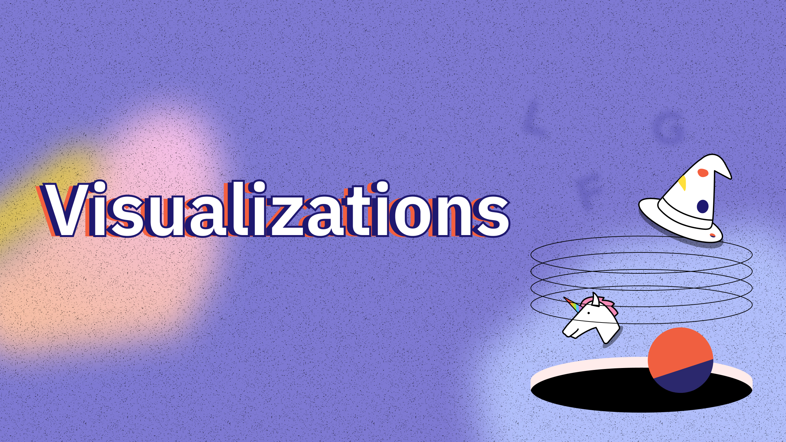

Visualizing your query results makes the results accessible and allows you to effectively communicate your findings to your audience.

Dune offers you a variety of different Visualization options:

* bar charts
* area charts
* scatter charts
* line charts
* pie charts
* counters

Combining these in a thoughtful manner allows you to best communicate your data to your audience.

## Creating Visualizations

You can create Visualizations from any query results in seconds using our Visualization engine.

Simply click on the `New Visualization` button and configure the Visualization to your needs.

One query can have multiple Visualizations.

**Read more about the different Visualization options here:**

- [Graphs](graphs.md)
- [Counters](counters.md)
- [Pie Charts](pie-charts.md)

## What you can do with Visualizations

Visualizations can either live on your [dashboard](/features/dashboards) or be embedded on their own using the [embed function](/features/sharing/embeds/)

