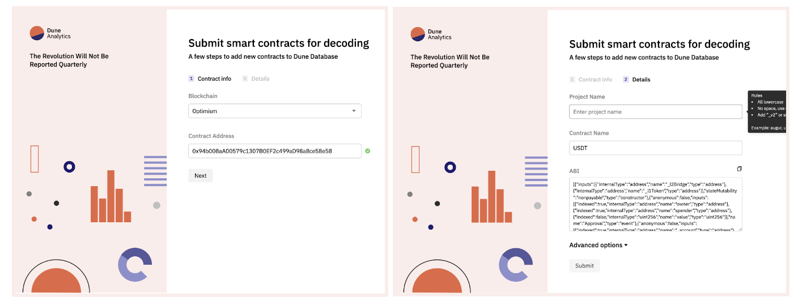

# Decoding Contracts

**Dune’s extensive catalog of decoded smart contracts are driven by our Wizards. Our decoding process empowers our community to submit the data and build the tables that they’d like to query on Dune!**

But what does decoding mean? Blockchain transaction data starts as bytecode, a low level programming language that can be read by machines. Using the ABI (Application Binary Interface) that is personal to each contract, we translate that bytecode into query-able data tables.

## A. The Lifecycle of Decoding

### Step 1: Submission

Our decoding process begins with our [contract submission page](https://dune.com/docs/app/decoding-contracts/)

To successfully submit a contract, you will need four pieces of information:

1. **Blockchain**: The name of the origin blockchain of the contract
2. Contract Address: The address associated with contract
3. Project Name: The name of the project that the contract originates from (ex. Tether) 
4. Contract name: The name of the smart contract as given by the Project (ex. USDT)
5. ABI: Unique to each smart contract. Further details can be found [here](https://docs.soliditylang.org/en/latest/abi-spec.html). Note that for contracts that are verified by a chain's explorer we will attempt to auto-fetch the ABI. Otherwise the ABI will need to be entered manually.         

In most cases, the contract name will be pulled directly from a blockchain scanner. We recommend using the name provided. If the name is not automatically provided, please follow our naming conventions to assure the contract is properly assimilated into Dune’s database.

**When do you need Advanced Options?**

**Are there several instances of this contract?**

Contract “instances” are essentially contracts that are on the same chain and have the same bytecode (and therefore the same ABI). If you toggle instances to “Yes”, Dune can decode all instances without multiple submissions. 

**Is it created by a factory contract?**

A factory contract is essentially a smart contract that creates other smart contracts. If there are multiple contract instances, there is a chance that it is due to a factory contract. If you toggle this question to “yes”, Dune can decode all contracts created by the same factory that use the same ABI, and store them in the same table (ex., pools from Uniswap V3). 

**Other Special Contracts**

Other special smart contracts can be decoded as well, following these conventions: 

Proxy contract: Submit using the proxy address but the ABI of the implementation

Diamond proxy contracts: Submit all the facets using just the same name for the project and contract and upload all the relevant ABIs. This can be done with one ABI representing all facets or separate ABIs for each facet.

!!! suggestion "Where can I find this information?"
    Contract addresses can usually be found in a project’s docs. Once you have the contract address, you can use a blockchain explorer to get the rest of the information. Most blockchain explorers have everything you need!

 What to Know about Re-Submissions 

 
Given the popularity of some smart contracts, re-submissions happen. If the contract you are trying to submit already exists, an error like the following will pop up.

There are some circumstances under which a contract can be resubmitted, like if the contract needs to be renamed. In that case, you can click **“Proceed to Resubmit”** and follow the steps to submit the contract as normal with one caveat: at the end of the submission process, you will be asked to explain why you want to resubmit the contract. Give as much detail as possible to avoid the resubmission being rejected! 

### Step 2: Decoding

Once the contract has been approved for decoding, you will receive a notification in your email. While the table itself may be visible after approval, it may be empty. No reason to worry! Note that it takes around 6 hours from the time the contract has been approved to be fully decoded and incorporated into the Dune database. 

### Step 3: Finding Your Decoded Contract

One quick tip to find and begin querying your decoded table is to use Dune's Explorer. When beginning a new query, the Explorer is located to the left side of the Query Editor. Drop the contract address of your decoded contract in the search bar, pull up the specific function or event you are looking for, and use the ">>" button to immediately populate that table in your Query Editor. 

Then it’s all ready for you to query. Let the data flow! 

## B. Frequently Asked Questions

 **What contracts can be decoded?** 

 
Any contracts launched on blockchains that Dune has integrated. To check which blockchains we currently have available, see our section on [Tables and Chains](https://dune.com/docs/data-tables/).

**How do I figure out if my contract has been decoded?**

 
There are two main ways to find out if your contract has been decoded. 

First: Account Settings

Information on submitted contracts can be found in your account settings under “Contracts”. The status of the contract will reflect one of the following: 

Pending
Approved/Rejected*

Note that once a contract has been approved, it takes around 6 hours for the data to be fully decoded and populated into our database.

*If the contract is rejected, hover your mouse over the status to see the reason for the rejection. 

Second: Our [Contract Decoding Dashboard](https://dune.com/dune/is-my-contract-decoded-yet-v2)
  
Built by our decoding team, this dashboard gives you information on the status of any submitted contract. Input the contract address in the box at the top of the dashboard and if the contract has been decoded, the contract information will populate the box along with where it is located in the Dune database. 

 I see data on Dune but it doesn’t match or is missing what I expected to see. 

 
Unfortunately, Dune only has access to contract data in circumstances that the contract performed an event that left a trace. Our recommendation is to check out the {blockchain}.traces table to see what information is available for a particular contract.

Alternatively, some contracts are upgradeable (ie., the smart contract code can be modified). In this case we may not have all of the ABIs. ABIs can be checked in the ABI column of the {blockchain}.contracts tables. A contract can always be resubmitted with missing ABIs so we can update our data. 

 **My submission got rejected, why?** 

 
Submissions can be rejected for a number of reasons, including not following the naming conventions, not providing clear data at submission, etc. The particular reason for a contract submission being rejected can be found in account settings under “Contracts” by hovering the mouse over the “Rejected” status. 

