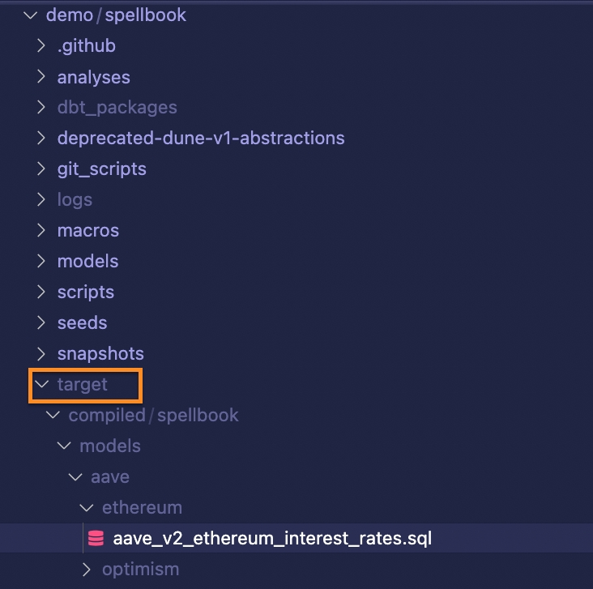

To get started, you’ll need to install:

* [VSCode](https://code.visualstudio.com/) (any IDE will work but this is what we use)
* [Python 3.9](https://realpython.com/installing-python/) (you need this exact version of Python and distutils installed; if you have trouble ask for help in our [#spellbook Discord channel!](https://discord.com/channels/757637422384283659/999683200563564655))
* [pip](https://pip.pypa.io/en/stable/installation/)
* [pipenv](https://pypi.org/project/pipenv/)
* [git and GitHub](https://docs.github.com/en/get-started/quickstart/set-up-git) (including authentication)

After that, you’ll also need to:

* Make a [fork](https://docs.github.com/en/get-started/quickstart/fork-a-repo) of the [spellbook repo](https://github.com/duneanalytics/spellbook). Including cloning locally and adding an upstream. 
* Review Github’s [instructions](https://docs.github.com/en/pull-requests/collaborating-with-pull-requests/proposing-changes-to-your-work-with-pull-requests/creating-a-pull-request-from-a-fork) on how to make a pull request from a fork. 

Here’s a quick video showing how to make a fork of the Spellbook repo:


Essentially you:

1. Go to the Spellbook repository and click the fork button at the top.
2. Copy the HTTPS URL of your fork
3. Open the folder that you’d like to store Spellbook in inside of VS Code
4. Open a terminal in VS code and enter `git clone [paste your URL here]`

Once you hit enter, you’ll start downloading Spellbook, it’ll take a few minutes.

## Setting up Spellbook dbt

Once you have a local copy of your Spellbook fork, it’s time to set up Spellbook dbt!

If it isn’t already, open your local copy of your Spellbook fork in VSCode, then open a terminal and enter `pipenv install`.

This will install the packages necessary to run Spellbook on your computer.

Once that installation is complete, run `pipenv shell` to activate your virtual environment.

Then `dbt init` to initialize dbt.

Enter the value 1 to select Trino as shown below:

```
Running with dbt=1.4.6
Setting up your profile.
Which database would you like to use?
[1] trino

(Don't see the one you want? https://docs.getdbt.com/docs/available-adapters)

Enter a number: 1
```

This will create a template for the profiles.yml file. After you hit enter, you'll be prompted with the location of this file. 

```   
Profile spellbook written to /Users/{your_user}/.dbt/profiles.yml using target's sample configuration. Once updated, you'll be able to start developing with dbt.  
```

Open the file with `open /Users/{your_user}/.dbt/profiles.yml` and change the following lines:

Before editing:
```
spellbook:
  outputs:

    dev:
      type: trino
      method: none  # optional, one of {none | ldap | kerberos}
      user: [dev_user]
      password: [password]  # required if method is ldap or kerberos
      database: [database name]
      host: [hostname]
      port: [port number]
      schema: [dev_schema]
      threads: [1 or more]

    prod:
      type: trino
      method: none  # optional, one of {none | ldap | kerberos}
      user: [prod_user]
      password: [prod_password]  # required if method is ldap or kerberos
      database: [database name]
      host: [hostname]
      port: [port number]
      schema: [prod_schema]
      threads: [1 or more]

  target: dev
```

After editing:
```
spellbook:
  outputs:
    dev:
      type: trino
      method: none
      user: x
      password: x
      database: tpch
      host: localhost
      port: 8080
      schema: wizard
      threads: 1
      http_scheme: http
  target: dev
```

This will not connect to the Dune database but you have access to some dbt actions.

**Selecting schema `wizard` is important. This indicates you are an external contributor.**

With this configuration saved, run `dbt deps` to install dependencies.

Next, we need to set up a Trino server. We will use Docker to do this. If you do not have Docker installed, you can download it [here](https://www.docker.com/products/docker-desktop).

Then, we will follow the Trino Docker setup outlined [here](https://trino.io/docs/414/installation/containers.html):

Run:

```console
docker run --name trino -d -p 8080:8080 trinodb/trino:414
```
The first time you run this command, it will take a few moments to download the image. On subsequent runs, this will be much faster.

If you see an error like the one below. Make sure Docker is running by opening the application. You should see the docker whale logo in your menu bar.

```console
docker: Cannot connect to the Docker daemon at unix:///var/run/docker.sock. Is the docker daemon running?.
See 'docker run --help'.
``` 

You can check the status of the container with:

```console
docker ps
```

You should see something like this if it succeeded: 

```console
CONTAINER ID   IMAGE               COMMAND                  CREATED              STATUS                        PORTS                    NAMES
7fb5aa1f12cb   trinodb/trino:414   "/usr/lib/trino/bin/…"   About a minute ago   Up About a minute (healthy)   0.0.0.0:8080->8080/tcp   trino

```

Start the Trino server with: 

```console
docker start trino
```

When you are done developing, run `docker stop trino` to stop the server.

Finally, run `dbt compile`.

If that runs correctly your terminal should end with “done” and you should see the “target” folder in your sidebar



Lastly, run `git checkout -b workshop` to create a new, locally stored branch called “workshop” for doing the practice work in this guide.

Finally, run `git push -u origin workshop` to add or “push” your local “workshop” branch to your remote GitHub repository so we can eventually make our Spellbook pull request.