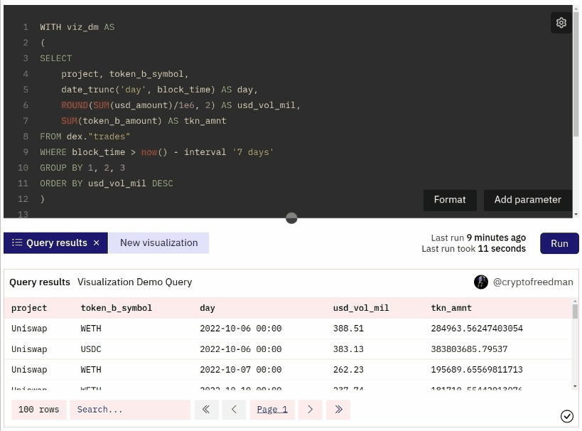

With your blockchain data gathered and organized via [Queries](../../features/queries/), it's time to add a bit more ✨ with Visualizations.

With Dune, you have a variety of ways to transform your Query data into visual data:

[**Chart visualizations**](charts-graphs.md)

* Bar charts
* Area charts
* Scatter charts
* Line charts
* Pie charts

[**Other visualizations**](other-visualizations.md)

* Counters
* Tables

Combining these in a thoughtful manner allows you to best communicate your data to your audience via [Dashboards](../../features/dashboards.md) and [Embeds](../sharing/embeds.md).

## Creating Visualizations

You can create Visualizations from any Query results in seconds using Dune's Visualization engine.

To get started, click the New Visualization button:

You'll then see a dropdown appear with a list of the available types of Visualization. Select the one you want then click the Add visualization button to create your Visualization:

You can create multiple Visualizations from one Query (to test which works best or reveal different insights) by repeating the steps above: 

**Read more about how each Visualization type works here:**

- [Charts & Graphs](charts-graphs.md)
- [Counters & Tables](other-visualizations.md)

## Sharing Visualizations

Once you've created a Visualization you're happy with, you can share it with others on a [Dashboard](../dashboards.md) or be embedded on another website using an [Embed](../sharing/embeds.md).

### Adding Visualizations to Dashboards

To add a Visualization to a [Dashboard](../dashboards.md), click the Add to dashboard button:

Then either click the Add button next to one of your existing Dashboards:

 Or create a new Dashboard and add your Visualization to it like so:
 
 1. Click the New dashboard button
 2. Add a name
 3. Click the Save dashboard button
 4. Click the Add button next to your new Dashboard

To view the Dashboard you added your Visualization to, click it's name in the pop up:

When you change your Visualization, it will be updated on your Dashboard too:

To remove a Visualization from a Dashboard, click the Added button:

### Creating Visualizations Embeds

To create an [Embed](../sharing/embeds.md) from your Visualizations, first select the Visualization you want to embed, then click the Embed button above the [Data Explorer](../../features/queries/data-explorer.md):

