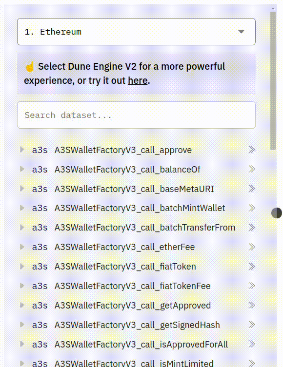
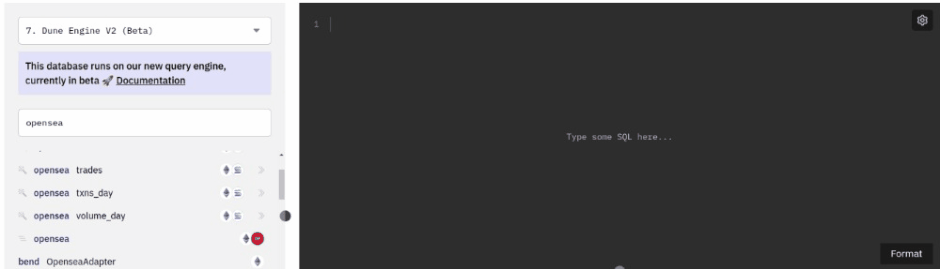
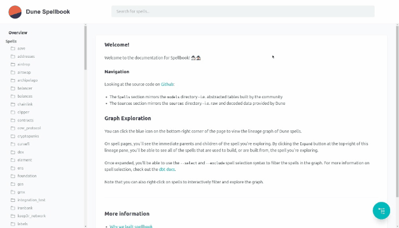
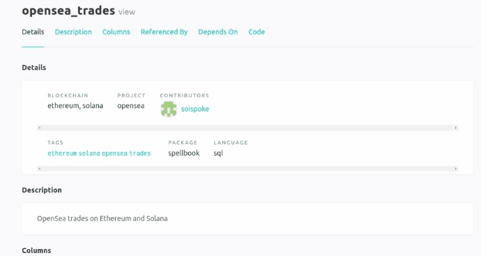
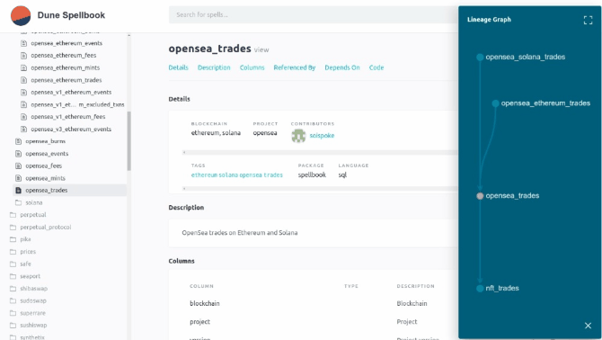
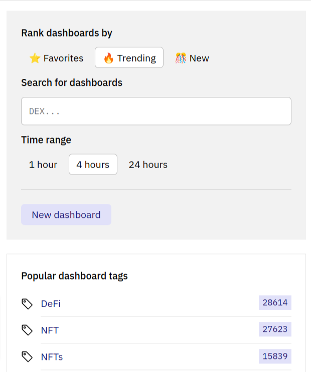
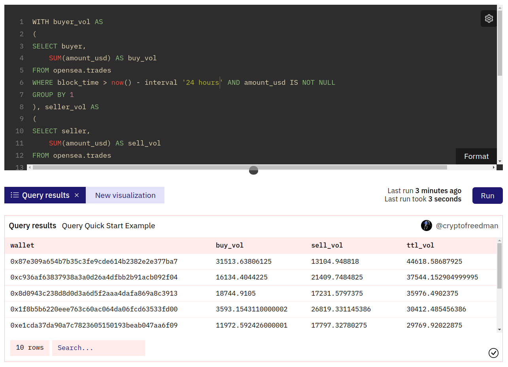
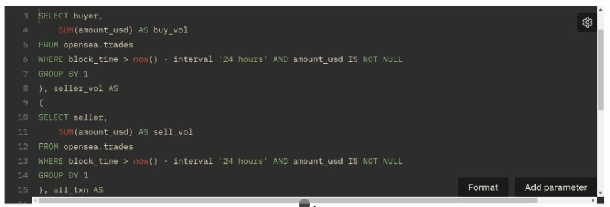
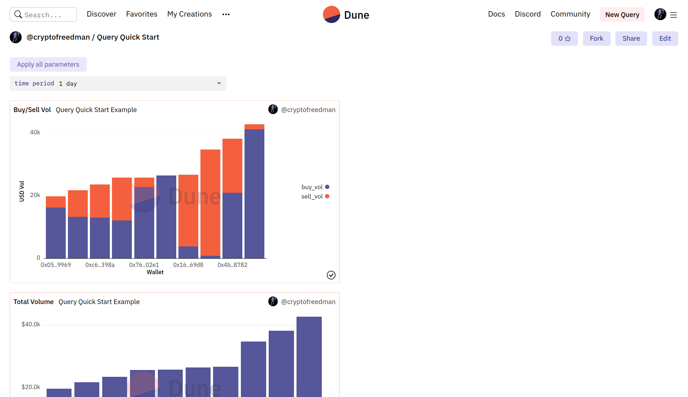

Let's walk through an example of building a query using [OpenSea](https://opensea.io/) data to:

- Figure out who the top buyers and sellers are by USD
- Visualize this in some sort of distribution, over some sort of time period.

If you get stuck, [fork and test out the demo query here](https://dune.com/queries/1424158?) or ask for help in the [#query-questions Discord channel](https://discord.com/channels/757637422384283659/757641002138730588)!

## 1. Find the main point of entry

The easiest place to start your query exploration is the [Dune Data Explorer](../../features/queries/data-explorer.md), for two reasons:

1. Searching here will let us discover whether the contracts we'll need have already been decoded; if so we'll have a lot less work to do.
2. If our data is already [Decoded](../../features/decoded-contracts.md), the contracts, calls, events, and data points will probably have obvious labels - eg `amount_usd` is the US dollar amount an NFT was bought/sold for. So we might not need to dig through the project docs to understand which contracts and data we need to build our Query.

So, let's get started by switching to the Dune V2 data set and searching for "opensea" to see what we find.

By using Dune V2, we get access to [Spells](../../spellbook/) which can let us access data from multiple blockchains in one Query - assuming the spell for OpenSea exists (Dune V2 is still in beta so not all data has been migrated yet).



Awesome! Looks like we have an "opesea trades" Spell (Spells are marked by the 🪄 icon in the data explorer).


## 2. Explore the contract flow

There are a couple of ways we can check to see what data we have access to in there.

### Run a `LIMIT` query

The first way is to run a `SELECT *` + `LIMIT` search to see what comes up.

`SELECT *` tells Dune to send us every column avaiable in this table.

`LIMIT` limits the number of rows returned so we don't try to return the whole table (this would take forever to load).



Note a couple of things here:

1. Dune has a nice auto complete feature - just start typing to see options and hit enter to paste ([learn more about how the Query Window works here](../../features/queries/query-window.md))
2. You can click the >> next to a table name in the Data Explorer to automatically paste that into your query ([learn more about the Data Explorer here](../../features/queries/data-explorer.md))

Also since this is a pre-made how to guide you can just be lazy and copy this code:

``` sql
SELECT *
FROM opensea.trades
LIMIT 10
;
```
From that Query you'll get a table with data to explore like this:


### [Dune V2 Only] Search the Spellbook Docs

Another benefit of Dune V2 is the special set of auto-generated docs that come with it.

These can help us quickly figure out what data exists inside of V2 tables AND see how those tables are constructed in case we need it to make more complex queries.

Let's head over to [https://dune.com/spellbook](https://dune.com/spellbook) and search for `opensea` using the top search bar:



Here we find an [`opensea_trades` table](https://dune.com/spellbook#!/model/model.spellbook.opensea_trades) that probably has some interesting data!

Scrolling through the columns section we can see all the different data columns it has.

Since this is a [Decoded Table](../../tables/decoded.md), a lot of the labels - like `amount_usd` - make sense just by reading them.

For those that aren't so obvious - like `trade_type` - we can click to get a description:



The Spellbook Docs also have a Lineage Graph which lets us view the tables that were used to build, as well as the tables built from `opensea_trades`:


We can also click the expand button in the right hand corner to see the complete flow of parent and child tables, then right click on any of them to view their documentation as well:



For a complete list of things you can do with the [Spellbook Docs see this page](../../spellbook/spellbook-model-docs.md).

## 3. Decide what question you want to answer

This step could easily be the first, and is in many cases - a Wizard will hear about a new NFT launch on crypto twitter, be shilled a new project on Discord, or read a story about an emerging market segment and dive into Dune to pull data and learn more.

And in this example, to make it easy on you, we've already decided to:

- Figure out who the top OpenSea buyers and sellers are by USD
- Visualize this in some sort of distribution, over some sort of time period.

### Finding inspiration from Dune Dashboards

As a beginner, if you don't already have an idea of what you want to build, exploring Dune data from the Query builder is a fun way to dive in.

You can also use the [Dune Explorer](../dune-explorer.md) to see what others are building as well!

Though this might not lead you to building the next [DeFi users over time](https://dune.com/rchen8/defi-users-over-time) (created by [@richardchen](https://dune.com/rchen8)), it's a great way to learn more about using Dune as you can see what's possible and even fork existing Queries to modify further!

As a quick example of this, let's head over to [dune.com](https://dune.com/browse/dashboards) which will take us to right to the Dashboard Explorer page.


By default, the Explorer lists dashboards trending in the last 4 hours.

Using the right sidebar, we can also search by:

- Newest dashboards
- Dashboards with the most stars (Favorites)
- By Tags like DeFi and NFT



At the time of writing, [@niftytable's](https://dune.com/niftytable) [Trending Contracts](https://dune.com/niftytable/trending-contracts) dashboard is trending in Dune so let's take a look:


Hmm, looks like this shows us top contracts by number of transactions, active wallets, and gas spent.

But what about by USD value of transactions?

To fork these Queries and add that data we just click the [Visualization name](../../features/visualizations/) (in this case a [Table Visualization](../../features/visualizations/other-visualizations.md)), then click the <span class="fk-btn-3">Fork</span> button at the top left:


From there we could explore, test, and expand on [@niftytable's](https://dune.com/niftytable) original Query to make it our own!

## 4. Build your Query

Getting back to our OpenSea Query example, our goal again is to:

- Figure out who the top OpenSea buyers and sellers are by USD
- Visualize this in some sort of distribution, over some sort of time period.

We've run an initial limit search and found that, among other data points, this Spell has `buyer` and `seller` wallet addresses, as well as `amount_usd` for these transactions.

### Pulling relevant `buyer` data

So let's refine our Query a bit to step closer to where we want to be, starting by:

1. Only pulling info for buyers
2. Adding all USD amounts for transactions for the same buyer together
3. Limiting our search by Time, say the last day, instead of by number of rows

Here's the before and after of how to do that:

!!! note
    `--` lines are SQL comments here for clarification, you don't need these to run this code yourself. We also added more spacing than needed to make it easier to read in the "After" Tab, so use the "Copy/Paste" tab to run this Query yourself!

=== "Before"
    ``` sql
    SELECT *
    FROM opensea.trades
    LIMIT 10
    ;
    ``` 
=== "After"
    ``` sql
    -- Returns the `buyer` column from opensea.trades, then adds all the `amount_usd` values together and labels them as `buy_vol`
    SELECT buyer, SUM(amount_usd) AS buy_vol 
    FROM opensea.trades
    
    -- limits results to the past 24 hours and removes resuls where amount_usd is empty (for some reason that data is unavailable in the opensea.trades Spell)
    WHERE block_time > now() - interval '24 hours' AND amount_usd IS NOT NULL 
    
    -- Tells Dune to SUM USD values for each buyer and return the results that way
    GROUP BY 1
    ;
    ``` 
=== "Copy/Paste"
    ``` sql
    SELECT buyer, SUM(amount_usd) AS buy_vol 
    FROM opensea.trades
    WHERE block_time > now() - interval '24 hours' AND amount_usd IS NOT NULL 
    GROUP BY 1
    ;
    ``` 


### `JOIN`ing `buyer` and `seller` data 🤝

Cool, looks like that works for buyers!

Now to make this work for buyers and sellers, we're going to have to get fancy.

We'll wrap this basic query in a `WITH` statement, so we can return two separate tables, one for buyers and sellers, then use `FULL JOIN` to create a new table with buy, sell, and total USD volume for each unique wallet address.

=== "Before"
    ``` sql
    SELECT buyer, SUM(amount_usd) AS buy_vol
    FROM opensea.trades
    WHERE block_time > now() - interval '24 hours' AND amount_usd IS NOT NULL
    GROUP BY 1
    ;
    ``` 
=== "After"
    ``` sql
     -- Here we define a new table `buyer_vol` based on the SQL query within the below ()
    WITH buyer_vol AS
    (
    SELECT buyer,
        SUM(amount_usd) AS buy_vol
    FROM opensea.trades
    WHERE block_time > now() - interval '24 hours' AND amount_usd IS NOT NULL
    GROUP BY 1

    -- The `,` here lets us continue our `WITH` statement with an additional table/query
    ), seller_vol AS 
    
    (
    SELECT seller,
        SUM(amount_usd) AS sell_vol
    FROM opensea.trades
    WHERE block_time > now() - interval '24 hours' AND amount_usd IS NOT NULL
    GROUP BY 1
    ), all_txn AS

    (
    -- Here we're relabeling the `buyer` column, which contains a wallet address, as `wallet`, returning the buy/sell volumes from each of our above tables, then summing those values as `ttl_vol`
    SELECT buyer AS wallet, buyer_vol.buy_vol, seller_vol.sell_vol, SUM(buyer_vol.buy_vol+seller_vol.sell_vol) AS ttl_vol 
    FROM buyer_vol

    -- "JOIN" is used to combine two tables that share a common column; "FULL" ensures our new table includes people who only bought, only sold, and both. Learn more about JOIN in [Dune V2 Apache Spark SQL here](https://spark.apache.org/docs/latest/sql-ref-syntax-qry-select-join.html#full-join).
    FULL JOIN seller_vol ON buyer_vol.buyer=seller_vol.seller -- here we're combining our `buyer_vol` and `seller_vol` tables by matching `buyer` and `seller` which we know are both wallet addresses
    GROUP BY 1, 2, 3
    
    -- Here were ensuring our table is ordered by total trade volume, starting with the highest number to the lowest
    ORDER BY ttl_vol DESC
    )

    -- Finally, below we return all the columns and rows from the combined table we just made; Limit to the TOP 10 wallets by total volume
    SELECT *
    FROM all_txn
    LIMIT 10
    ;
    ``` 
=== "Copy/Paste"
    ``` sql
    WITH buyer_vol AS
    (
    SELECT buyer,
        SUM(amount_usd) AS buy_vol
    FROM opensea.trades
    WHERE block_time > now() - interval '24 hours' AND amount_usd IS NOT NULL
    GROUP BY 1
    ), seller_vol AS
    (
    SELECT seller,
        SUM(amount_usd) AS sell_vol
    FROM opensea.trades
    WHERE block_time > now() - interval '24 hours' AND amount_usd IS NOT NULL
    GROUP BY 1
    ), all_txn AS
    (
    SELECT buyer AS wallet, buyer_vol.buy_vol, seller_vol.sell_vol, SUM(buyer_vol.buy_vol+seller_vol.sell_vol) AS ttl_vol
    FROM buyer_vol
    FULL JOIN seller_vol ON buyer_vol.buyer=seller_vol.seller
    GROUP BY 1, 2, 3
    ORDER BY ttl_vol DESC
    )

    SELECT *
    FROM all_txn
    LIMIT 10
    ;
    ``` 



### Adding Parameters

Now for extra points, let's add a [Parameter](../../features/parameters.md) so people who view our Visualizations can filter by 1 day, 1 week, and 1 month time periods.

To do that, let's highlight our `24 hour` interval measure, then click the <span class="fk-btn-5">Add parameter</span> button



Then click the Gear icon in the field that appears below the Query Window to modify our parameter:


Here we'll:

1. Rename unnamed_parameter -> time period
2. Make the Parameter Type "List"
3. Add the values "1 day, 1 week, 1 month"
4. And save!


Lastly, we'll update our other `WHERE` statements with the parameter.

### Ready to Visualize 👀

With that, we have the data we need to make the visualizations we're aiming for. 🪄

Here are our results, click "Query results" below to see the Query and fork it if you'd like! 🧙


## 5. Make your Visualization

Alright, now we want to "Visualize this in some sort of distribution, over some sort of time period."

We've got our time period piece in place with our Parameter, and we have total USD bought, sold, and wallet data.

So for {{time period}} let's look at our top 10 wallets by total volume, as well as what portion of that volume is buying vs selling.

### Creating and Formatting Bar Charts

To do that we'll use a Bar Chart [Visualization](../../features/visualizations/index.md):


Scrolling down we see Visualization options, it looks like the "Results Data" defaulted to making the x column `wallet` and y column 1 `buy_vol`, which is a good start.

Let's add `sell volume` to y column 2 and then in the "Chart options" Enable Stacking so the values are layered on top of each other:


By default, Dune sorted our x-axis alphabetically. Let's uncheck "Sort Values" to get it back to being sorted by volume, then "Reverse Order" so that our graph is lowest number to highest (the opposite of our data table but the way we're love to see graphs - up and to the right):


Our USD amounts are also a bit confusing, so let's update the "Label Format" in Y-axis options to `$0.0a` which will turn a number like 12345.6789 into "$12.3k":


Then we'll update our title and x/y axis labels to make a nice, easy to understand chart:


Learn more about [formatting Visualizations here](../../features/queries/query-results/#formatting-results-tables)!

### Sharing Queries and Visualizations

[To share your Queries](../../features/sharing/index.md) (either embedding them like the above or just to share a lin), click the <span class="fk-btn-3">Embed</span> button above the Query window:


!!! note
    The embed button works as a stand alone link and as a way to embed your live graphs into websites/apps. If your Query has no Visualizations, the link will be to the Query Results table. If you have multiple Visualizations, the link will be for whichever Visualization you've selected when you clicked the Embed button.

With a lot of copy/paste (literally and figuratively), we can make this same graph for just total volume so we don't have to do the mental math of adding up the sell/buy volume:


### Making a Dashboard

Finally, let's add our two visualizations to a starter [Dashboard](../../features/dashboards.md).

To do that we:

1. Click the <span class="fk-btn-3">Add to dashboard</span> button above our Visualization.
2. Click <span class="fk-btn-3">New dashboard</span> button in the popup.
3. Give our Dashboard a name and save it.
4. Click the <span class="fk-btn-2">Add</span> button.


Then we just add our other visualizations to the Dashboard we created and:



To make our Dashboard look nice, we hit the edit button and can drag and resize our Visualizations:


And we can add text widgets to explain our dashboards and how they work!


And with that, we're ready to hit the share button to get a sharable Dashboard link like this one: [https://dune.com/cryptofreedman/query-quick-start](https://dune.com/cryptofreedman/query-quick-start)

## Congrats you've made a Dune Query!

To go deeper as you're getting started, check out the other pages in our Getting Started section using the left side bar. 👈

Check out the Features section above to learn more about how Dune works or the Tables section to learn more about the data you can query and use with Dune. 👆