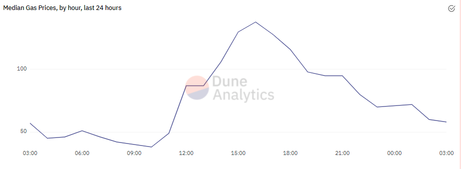

**Since Dune has almost all blockchain data in one place, we can also discover and explore more general ecosystem-level metrics.**

## [Gas Prices](https://dune.com/kroeger0x/gas-prices) by [@kroeger0x](https://dune.com/kroeger0x)

@kroeger0x easily assembled the data on average gas spent per tx, gas limit, gas spent in total in a block etc. and made it just as easy for us to view using Dune.

## [DeFi Adoption](https://dune.com/rchen8/defi-users-over-time) by [@rchen8](https://dune.com/rchen8)

[Richard Chen](https://twitter.com/richardchen39) has compiled the user numbers of all important DeFi Protocols and compiled them in one Dashboard.

