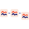

Dune is a powerful tool for blockchain research, complete with all the tools you need to discover, explore, and visualize vast amounts of blockchain data.

 Dune is your key to answering questions like:

- [How much volume flows through Uniswap each day?](https://dune.com/queries/3)
- [Which Dex has the highest volume?](https://dune.com/queries/1847)
- [How are important Stablecoins behaving today?](https://dune.com/hagaetc/stablecoins)

## Dune in 5-minutes ⚡

## How the data flows

Public blockchains are [open and free](https://dune.com/blog/revolution-not-quarterly), so getting data from them shouldn’t be that hard right?

Yes and no.

Compared to getting siloed data from traditional businesses to, say, analyze how international shipping speeds affect consumer demand for the latest Parisian couture…

Yes viewing and analyzing blockchain data is “easier.”

But there’s a lot going on under Dune’s proverbial hood. Let’s pop it open and take a look to better understand how state changes on a public blockchain like Ethereum turn into data you query to build charts and graphs.

###   1. A chain adds a block

While the technical details vary, at the core of every blockchain a set of transactions is proposed, agreed upon, then appended to the end of a chain of blocks containing transactions previously agreed upon.

There are a variety of [consensus mechanisms](https://crypto.com/university/consensus-mechanisms-in-blockchain), methods of determining which block is the next block, but once consensus is reached information about the latest block is broadcasted across the blockchain’s network to let its participants (“Nodes”) know about this new block and add it to their records.

[Check out this awesome Blockchain 101 demo](https://andersbrownworth.com/blockchain/) for more details about how blockchains work!

###  2. Node providers transmit data to Dune

To receive this “new block created” message, someone has to run a [blockchain node](https://www.alchemy.com/overviews/what-is-an-ethereum-node) - a computer running “client” software that connects them to a blockchain’s network, allows them to send information back and forth between other nodes, and in some cases validate transactions and store data.

With a bit of technical know-how, anyone can run a node - that’s a big part of what makes a blockchain _public_!

Because almost anyone can run a node, there’s a lot of transparency in the system to keep participants honest. 

This transparency also makes it possible to leverage the hive mind by allowing data analysts to access a complete picture of “what’s happening” and do any sort of analysis they want.

No struggling to access raw data required.

To help projects like Dune operate at scale, [node providers](https://www.alchemy.com/overviews/blockchain-node-providers) build and operate node infrastructure that captures blockchain data and makes it accessible to us via an Application Programming Interface (API).

In this way we can focus on making the best possible data-accessibilty experience while the node providers can focus on running nodes as efficiently as possible.

###  3. Dune adds raw data to SQL tables

Our node providers send blockchain transaction data to us as hashed bytecode (for instance, Ethereum data is hashed using [the keccak256 algorithm](https://medium.com/0xcode/hashing-functions-in-solidity-using-keccak256-70779ea55bb0)).

The Dune Data Engine takes this bytecode and extracts it into a set of Tables we call “[Raw Data](https://dune.com/docs/tables/v2/raw/).”

These can vary slightly from chain to chain, but as an example, most [Ethereum Virtual Machine (EVM)](https://dune.com/docs/tables/v2/raw/ethereum-mainnet/creation-traces/) based chains include:

* [[chain].blocks](https://dune.com/docs/tables/v2/raw/ethereum-mainnet/blocks/) - groups of transactions appended to the chain.
* [[chain].creation_traces](https://dune.com/docs/tables/v2/raw/ethereum-mainnet/creation-traces/) - transactions that contain [`create` traces](https://medium.com/coinmonks/ethereum-data-evm-traces-simplified-5e297e4f40a4) (sometimes these are in internal transactions)
* [[chain].logs](https://dune.com/docs/tables/v2/raw/ethereum-mainnet/event-logs/) -  [event logs](https://medium.com/mycrypto/understanding-event-logs-on-the-ethereum-blockchain-f4ae7ba50378) created by smart contracts
* [[chain].traces](https://dune.com/docs/tables/v2/raw/ethereum-mainnet/traces/) - [trace data](https://medium.com/coinmonks/ethereum-data-evm-traces-simplified-5e297e4f40a4) generated by transactions in a block
* [[chain].transactions](https://dune.com/docs/tables/v2/raw/ethereum-mainnet/transactions/) - cryptographically signed instructions sent from one address to another.

Data in these tables are human readable (whereas bytecode is not), but requires extensive blockchain knowledge to understand and interpret.

This Raw Data can also take a lot more work to manipulate into interesting insights, which is why Dune [decodes](https://dune.com/docs/tables/decoded/) this data.

###  4. Dune decodes raw data

Raw `.log` tables return data that looks like this:

| Field   | Data                                                                 |
| ------- | -------------------------------------------------------------------- |
| tx_hash | `0x2bb7c8283b782355875fa37d05e4bd962519ea294678a3dcf2fdffbbd0761bc5` |
| topic1  | `0xddf252ad1be2c89b69c2b068fc378daa952ba7f163c4a11628f55a4df523b3ef` |
| topic2  | `0x00000000000000000000000075e89d5979e4f6fba9f97c104c2f0afb3f1dcb88` |
| topic3  | `0x00000000000000000000000087d9da48db6e1f925cb67d3b7d2a292846c24cf7` |
| data    | `0x00000000000000000000000000000000000000000000001a894d51f85cb08000` |

Data in this form has some fairly limited data analysis use cases.

To transform this data into something a lot more usable, [Wizards submit smart contracts for decoding here](https://dune.com/contracts/new).

When that happens, we use the smart contract’s [Application Binary Interface (ABI)](https://www.alchemy.com/overviews/what-is-an-abi-of-a-smart-contract-examples-and-usage), which is similar to a Web 2.0 API, to understand what’s happening inside the transactions that interact with the contract.

We then create [Decoded Tables](https://dune.com/docs/tables/decoded/) that are a lot easier to do analysis with.

For example, the above transaction, once decoded, looks like this:

| Field       | Data                                                                 |
| ----------- | -------------------------------------------------------------------- |
| evt_tx_hash | `0x2bb7c8283b782355875fa37d05e4bd962519ea294678a3dcf2fdffbbd0761bc5` |
| "from"      | `0x75e89d5979e4f6fba9f97c104c2f0afb3f1dcb88`                         |
| "to"        | `0x87d9da48db6e1f925cb67d3b7d2a292846c24cf7`                         |
| value       | `489509000000000000000`                                              |

###  5. The Dune community casts Spells

With the help of our amazing community of Wizards, Dune goes a step beyond just decoding data with [Spells](https://dune.com/docs/tables/spells/).

Spells are custom tables, built and maintained by Dune and our community, that make it easy to aggregate lots of data with as little friction as possible.

For example one of the most popular Spells, [nft.trades](https://dune.com/spellbook#!/model/model.spellbook.nft_trades), makes it easy to explore and transform NFT trading data across protocols and blockchains without having to compile trades from Magic Eden on Solana, LooksRare on Ethereum, etc yourself.

###  6. Dune Wizards make magic

From all this data, Wizards build [Queries](getting-started/queries/index.md) using SQL, a widely-used language for storing, manipulating and retrieving data in databases.

From these Queries they build the [Visualizations](getting-started/visualizations/index.md) and [Dashboards](getting-started/dashboards.md) we all know and love!

Eg [@rchen8](https://dune.com/rchen8)'s OpenSea daily volume: 

## Making 🪄 with dune.com

Dune.com is the first killer app built on top of the Dune Data Platform, designed to make it as easy as possible for anyone with at least a little bit of SQL, Ethereum Virtual Machine, and Business knowledge to analyze blockchain data in interesting ways.

The basic building blocks of the Dune.com app are:

- **Dashboards:** A set of widgets containing Visualizations and text that tell a story about a particular group of blockchain data.
- **Visualizations:** Charts and Graphs that turn data in harder-to-understand table-form into easier-to-understand visual form.
- **Queries:** Commands that extract data from Dune's database so it can be displayed in Dune Dashboards via Tables and Visualizations.

As a Dune.com visitor, you view Dashboards containing text, Table, and Visualization widgets built from Queries.

As a Dune Wizard (what we call "blockchain analysts" because it's way cooler), you'll create custom Queries to fetch data, visualize the results of these Queries, and then tell stories with your data using Dashboards.

### Queries

Dune aggregates blockchain data into an SQL database that can be easily queried. 

[Queries](getting-started/queries/index.md) are used to specify what data from the blockchain should be found in the our database and returned.

Maybe you want to know _all the Dex trades that happened today_, or the _total value of stablecoins minted this year_. Whatever the question, discovering the answer starts with a Dune Query!

Queries return rows and columns of data (just like traditional SQL queries) that can then be used to create Visualizations that you present in Dashboards.

There are a few ways that a blockchain analyst (i.e. Wizard i.e. you!) can get started running Queries:

1. The simplest way is to use Dune [_Spells_](reference/tables/spells/index.md)) to query commonly used data tables. Some popular Spells include `dex.trades`, `lending.borrow`, and `stablecoin.transfer`.
2. Query the raw Ethereum data like blocks, logs, and transactions.
3. It is also possible to query centralized exchange data. For example, you can use `prices.usd` to quickly return the price of almost any cryptoasset.

### Visualizations

Data presented in table form (rows and columns) can be difficult to read. [Visualizations](getting-started/visualizations/index.md) take the results of a Query and present the information in a clear, precise, and _visual_ way.

With Dune Visualizations, it's easy to begin to tell a story with your data by transforming something like this:

Into something like this:

The Bar Chart Visualization makes it clear that April 19th had the highest transfer volume to help you and others see the trend over time.

Dune offers a variety of Visualizations you can use to visually present data including:

- **Bar Charts**
- **Area Charts**
- **Scatter Charts**
- **Line Charts**
- **Pie Charts**
- **Counters**
- **Tables**

### Dashboards

Using carefully planned visuals, a clever blockchain analyst (Wizard!) can tell a story about different collections of data through [Dune Dashboards](getting-started/dashboards.md).

For example, in the below Dashboard, [Dex Metrics](https://dune.com/hagaetc/dex-metrics) by [@hagaetc](https://dune.com/hagaetc), it's clear at the top that 'DEX' as a category is growing. Below, the audience sees which DEX's are the most popular by volume, and finally can view a stacked bar chart that shows changes over time.

Just by looking at this single Dashboard, anyone can get a clear picture of the entire DEX market.

## How to navigate these docs

We've built these docs to answer all your who, what, when, where, why, and how questions for anything/everything Dune!

Here's a quick run down of each of the sections:

- [Getting Started](getting-started/index.md) is where you'll get oriented and learn how to use Dune!
- [Reference](reference/index.md) is where you'll get answers to your "who, what, where" questions and find a few supplemental resources we've put together.
- [Spellbook](spellbook/index.md) is where you'll find everything you need to build and use Spells.
- [API](api/index.md) is where you'll find everything you need to integrate our API into your project.

If you're itching to get your wand working, jump over to our [Query Quick Start](getting-started/query-quick-start/index.md) for a walkthrough that will help you build your first Dune Query!

## Dune is a community effort

On Dune.com, all Queries and datasets are public by default (if you need Privacy for your Queries, our [Pro Plan](https://dune.com/pricing) has got you covered).

This makes it a snap for you, the Wizard, to fork and remix other creators' Queries to build on top of their knowledge and insights.

On the flip side, every new Query, you create helps other people learn new things about blockchains and cryptoassets through Dune.

This positive feedback loop is how the Dune Community Succeeds together through an ever growing range of Queries that allow us all to learn more!

Join our [Community Discord](https://discord.gg/BJBHFR6sdy) to get world class support from our team and the community.

Check out our [events calendar](reference/events.md) to join in the fun LIVE.

And if you have any feedback, whether feature requests or bug reports, please submit it [here](https://feedback.dune.com).
