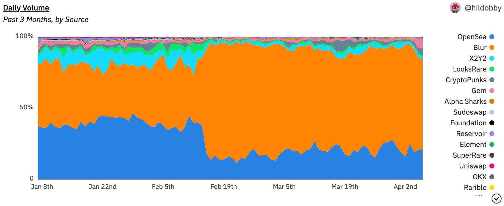

Dune is a web-based platform that allows you to query public blockchain data and aggregate it into beautiful dashboards.

!!! type "Quickstart"
    To get started with Dune in 5 minutes, see the [Quickstart](quickstart.md).

   
  <em>The world's blockchain data at your fingertips!</em>

Blockchains are open and transparent, but each chain is unique—making it difficult to understand, ingest, and aggregate data. Dune gives you the proper tools to analyze cross-chain data for different tokens, wallets, and protocols. You can also easily share your work with the community.

### Start building

Ready to start building? Once you have an [account](https://dune.com/auth/register) and you’ve reviewed the [Quickstart](quickstart.md), check out these essentials to start using Dune:

* Use the [Query Editor](/app/query-editor/) to explore data, write queries, and gain mastery
* Make stunning [visualizations](/app/visualizations/) with graphs, charts, and other unique options
* Create a [Dashboard](/app/dashboards/) to embed visualizations, graphics, and text to tell compelling stories with your data

### Learn more

If you’re new to blockchain or SQL—or want to go deeper on Dune concepts and best practices—check out the following resources:

* [Dune Official Getting Started Video Series](https://www.youtube.com/watch?v=S-cctFmR828&list=PLK3b5d4iK10ext4v-GBySekaA8-GP8quD&index=1) to learn how data flows and how to navigate the Dune app to get the most out of it
* [Web3 Analytics Resources](analytics_guidelines.md) to start performing your own analysis, or to find SQL and Blockchain resources for beginners
* Join our community in [Discord](https://discord.gg/dunecom) to get support through the `#🐥︱beginners` and `#🙋︱query-questions` channels

### Why Dune?

Dune—along with our massive community of users and experts—provides powerful tools and analysis of all onchain data. You can find a [dashboard](https://dune.com/browse/dashboards?q=dex&order=favorites&time_range=all) for pretty much anything web3-related, including for EVMs like Ethereum, Polygon, Goerli, and Optimism—and non-EVM chains like Solana and Bitcoin.

Examples of real dashboards:

* [NFT marketplaces](https://dune.com/hildobby/NFTs)
* [DEX metrics](https://dune.com/hagaetc/dex-metrics)
* [Bridges](https://dune.com/eliasimos/Bridge-Away-(from-Ethereum))
* [DAO Accounting (Maker)](https://dune.com/SebVentures/maker---accounting_1)
* [Base Chain Metrics](https://dune.com/optimismfnd/Optimism)

### Find an expert

There are many experts in the crypto community who specialize in Dune or have the necessary skills to get up to speed quickly.

[Post a bounty](http://bounties.dune.com/) to a pool of expert freelancers and receive responses from interested builders. You can also share the posted bounty within your network.
