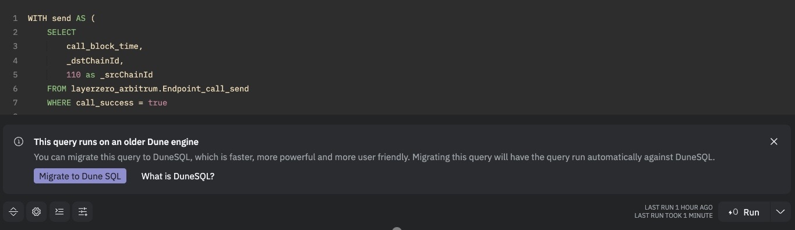
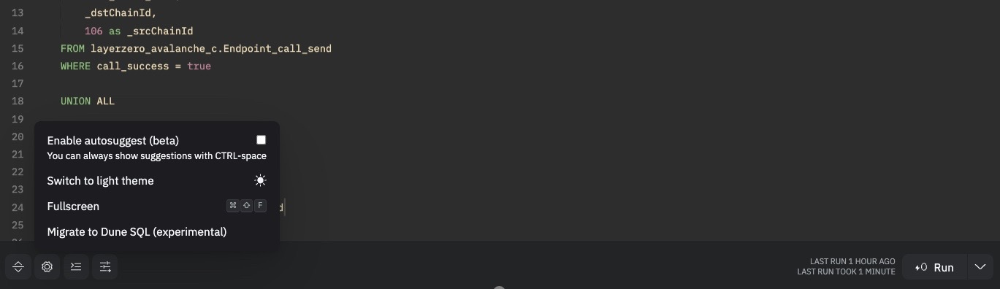

# Migration tool

Migrating your queries from SparkSQL and PostgreSQL to DuneSQL can be a tedious task. The Dune Migration tool will help you migrate your queries from SparkSQL and PostgreSQL to DuneSQL. 

The tool is open source and available in this [github repo](https://github.com/duneanalytics/harmonizer/). Contributions are very welcome! **If you run into issues, please let us know by [creating an issue](https://github.com/duneanalytics/harmonizer/issues).**

## How to use the tool

Whenever you are ready to migrate your queries, the tool will be available to you in the Dune Query Editor.  

Whenever you open a query running on SparkSQL or PostgreSQL, you will see a banner at the bottom of the query editor. Simply click on "Migrate to DuneSQL" and the tool will automatically convert your query to DuneSQL.

You can also always access the tool by opening the settings menu in the query editor and clicking on "Migrate to DuneSQL".

## Limitations

!!! warning "Warning"

    The tool is still under active development and has quite a few limitations.  
    We are working hard behind the scenes to improve the tool and will share updates as we make progress.  

**Known issues**

- The tool doesn't really know what your query is doing, so it will not be able to migrate all queries.
- The tool is not able to migrate queries that use UDFs.
- The tool is not able to accurately migrate queries that have a lot of casts().
- THe tool doesn't really know about the changes in our abstractions, e.g. if you used single chain dex.trades, you will now need to specify the chain within the query with e.g. ``where blockchain = 'ethereum'``.
- The tool is not able to migrate queries with ``dune_user_generated`` tables

In general, the tool is not yet able to migrate queries that are too complex. If you have a complex query, you will need to debug the outputs of the tool and make the necessary changes.

However, the tool takes care of a lot of table name changes and other minor changes, so **it will still save you a lot of time**.

## Further resources

For guidance on how to manually migrate your queries or debug the migration tool results, you can read the following articles:

- [SparkSQL](SparkSQL.md)
- [PostgreSQL](PostgreSQL.md)
