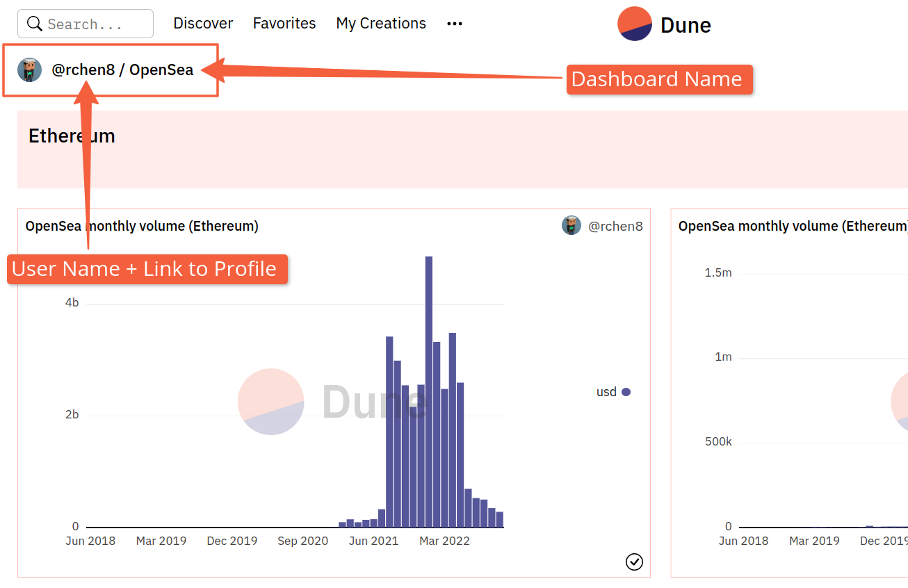

# How to reference Dune data!

Content on Dune is first and foremost the product of the creators ("Wizards") who build the Queries, Visualizations, and Dashboards we reference and share.

Any mention or use of data or Visualizations you find on our platform should reference Dune as the source of such information and include a Dune logo, a direct link to dune.com and a reference to credit the creator(s) of the Specific Query, Dashboard, or Data specific.

Crediting should be done as follows:

_"[@rchen8](https://dune.com/rchen8) via_ [_OpenSea monthly volume (Ethereum)_](https://dune.com/queries/3469/6913)_"._

If you're referencing a Dashboard, you can find the creator's User Name as well as the Dashboard's name at the top left of the page.

The link to the users profile can be found by clicking their User Name:

Likewise, you can find their User Name/Profile link and the Query/Visualization name at the top left side of a Query page:

For more info on how to get Embed links for Visualizations you want to share, [see this page](../getting-started/embeds.md)!

## Limitations of Commercial Use
Do note that any form of copying, transmitting, transferring, modifying or creating derivative works from the original Queries and the public Dashboard or wrapping them in a white label manner for free or resale is strictly prohibited.

Similarly, reproducing, sublicensing, transferring, duplicating, copying, selling, reselling, or any other forms of exploiting any portion, use or access to Dune without the express written permission by Dune is not allowed.