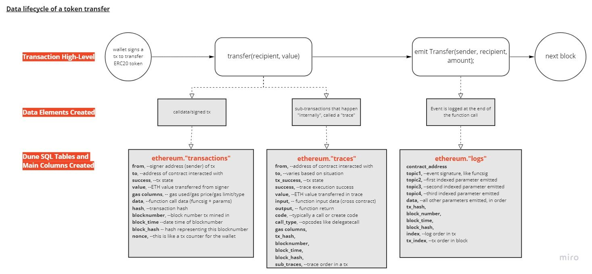

**Dune让你在已支持的链上的不同层次抽象表中检索数据。**

首先，你可以浏览各支持链上的原始数据，像 `blocks`和`transactions`。这是最灵活的方式。这是最灵活的方式。 

为了更方便地分析智能合约, Dune同时提供了一些独立的、易于阅读的解码数据表。我们为智能合约使用ABI，并为标准化代币(ERC20, ERC721 etc.)使用接口标准。 截至编写本文档，我们已为超过28万份的合约编制了索引，你可以在这里 [提交新合约](../features/decoded-contracts.md).

在此基础上，我们在构建一系列的 [Spells](spells.md) 为了一些常见的使用场景 (比如NFTs和DEX)和第三方的数据集.

以下列出了所有的数据种类:

- [原始数据](raw.md): 未经编辑和解码的原始链上数据
- [解码数据](decoded.md): (**最常用**) 根据命令和事件解码的智能合约数据 
- [Spells](spells.md): Dune和社区定制和维护的数据表
- [Community](community.md): 与某些组织合作取得的链下数据
- [Prices](prices.md): 第三方提供的价格数据
- [User generated](user-generated.md): 在提供数据基础上，构建自己的看板，功能和表格

具体的数据模型却决于特定的区块链和引擎。我们为[Dune V1 Engine](v1/raw/index.md) (PostgreSQL)和[Dune V2 Engine](v2/raw/index.md) (Databricks SQL)表格编制了详细的参考资料。 

## 如何通过原始数据生成数据表

!!! 注意
    为所有基于EVM的区块链的生成数据表的过程是类似的。以下标签遵循Dune V1的命名惯例，与V2表格略有不同。了解[V2数据结构的差异](http://localhost:8000/docs/features/dune-v2/）。并学习[如何检索V2数据](http://localhost:8000/docs/features/queries/data-explorer/#v2）。 

Dune中三个主要的表是由原始以太坊数据生成的，它们是平台上其他一切的来源。

Dune其他的数据表都是从这三个来源构建的:

如果你无法找到要查询的表，则需要在[相关链的区块链管理器]（../resources/wizard tools/blockchain explorers.md）上挖掘一个示例哈希，以找到调用/evt合同。

基本上是去`tx_hash`→ `在"to"中签订合同→ `然后从那里提取合同名称。如果是代理，区块链浏览器应该会将你链接到一个实现地址。

Dune V2数据还有一个方便的关联图，可以让你探索Dune的所有数据表如何相互关联-[在这里的联系图表部分可以了解更多信息]（../spellbook/spellbook model docs/）。

如果可以的话，你应该尽量使用[解码数据]（Decoded.md）或[Spell]（Spell.md）表，因为这些表是易读的，并且是预先组织好的，所以更容易使用。
