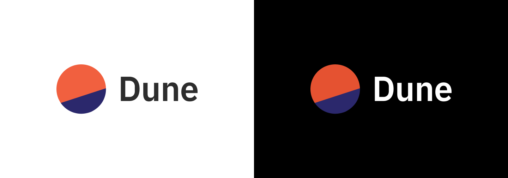

# 新闻资料包

## How to reference Dune data!

Content on Dune is first and foremost the product of the creators ("Wizards") who build the Queries, Visualizations, and Dashboards we reference and share.

Any mention or use of data or Visualizations you find on our platform should credit the creators of the Specific Query, Dashboard, or Data specific - not just "Dune".

Crediting should be done as follows:

_"[@rchen8](https://dune.com/rchen8) via_ [_OpenSea monthly volume (Ethereum)_](https://dune.com/queries/3469/6913)_"._

If you're referencing a Dashboard, you can find the creator's User Name as well as the Dashboard's name at the top left of the page.

The link to the users profile can be found by clicking their User Name:

Likewise, you can find their User Name/Profile link and the Query/Visualization name at the top left side of a Query page:

For more info on how to get Embed links for Visualizations you want to share, [see this page](../getting-started/embeds.md)!

## 主要 - 标准商标

这是 Dune 的主要商标。应尽可能使用这种格式。

- [dune-standard-logo.svg](images/dune-standard-logo.svg)
- [dune-standard-logo@2x.png](images/dune-standard-logo@2x.png)
- [dune-standard-logo-dark.svg](images/dune-standard-logo-dark.svg)
- [dune-standard-logo-dark@2x.png](images/dune-standard-logo-dark@2x.png)

## 垂直商标

- [dune-vertical-logo.svg](images/dune-vertical-logo.svg)
- [dune-vertical-logo@2x.png](images/dune-vertical-logo@2x.png)
- [dune-vertical-logo-dark.svg](images/dune-vertical-logo.svg)
- [dune-vertical-logo-dark@2x.png](images/dune-vertical-logo-dark@2x.png)

## 仅图标

- [dune-icon-only.svg](images/dune-icon-only.svg)
- [dune-icon-only@2x.png](images/dune-icon-only@2x.png)

## 整套商标集合

- [Dune-logo-Full.zip](images/Dune-logo-Full.zip)

