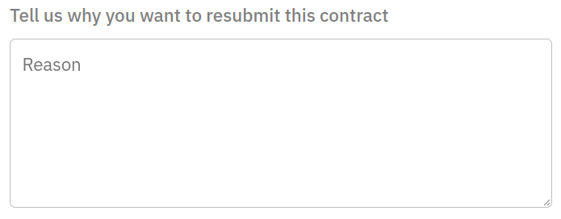

Dune 包含了大量的已解析合约目录，这些合约是通过巫师提交到平台上的！

在智能合约的 ABI（[应用二进制接口](https://www.alchemy.com/overviews/what-is-an-abi-of-a-smart-contract-examples-and-usage)）中定义的每个事件和功能，合约被解析成人类可读的数据表，而不是使用原始交易、日志和跟踪数据。

[在此](../../tables/decoded/)了解更多关于解析的工作原理和有哪些已解析的数据表。

## 提交一个新的合约进行解析

合约可以通过以下方式提交进行解码：

- [新合约表格](https://dune.com/contracts/new)
- 通过 [My Creations > Contracts 标签页](https://dune.com/browse/contracts/authored)
- 在查询编辑器侧边栏的数据集浏览器中：

合约提交表，包括 2 个步骤：

### 1. 区块链和地址

我们首先要求提供合约的地址和区块链。首先要求提供这些数据有两个目的：

1. 为了使我们能够审查潜在的重复合约和待提交合约。
2. 在我们能够做到的情况下，将提交程序的部分程序自动化。

后者通常是通过从 Dune 和其他相关的第三方来源获取潜在的有用的元数据来完成的。

例如，下面是一个 Optimism 上提交 USDT 合约（`0x94b008aA00579c1307B0EF2c499aD98a8ce58e58`）的例子：

如果我们能通过第三方来源找到合约，我们将在地址栏旁边显示一个绿色的勾。

这意味着我们能够获取合约的名称和 ABI（应用二进制接口）等信息。

### 2. 合约细节

在按下 "Next" 后，我们要求提供我们需要的关于合约的其他信息，以便对其进行解析：

如果我们通过其他第三方渠道找到合约，您只需填写项目名称。

我们在这方面有一些命名惯例，部分原因是我们的技术设置，也是为了使寻找数据更容易预测。

**项目命名规则**

- 全小写
- 没有空格（若有需要，使用下划线 "_"）
- 如果适用，在末尾添加 "_v2" 或其他版本名称

例如 `augur`、`tornado_cash`、`uniswap_v2`

一旦您提交，您就完成了！合约将被储存在我们的队列中，我们将人工审查以保证质量。

!!! note
    
    提交的合约可能需要几天的时间才能得到处理，请耐心等待！🙏

### 高级选项

在某些情况下，Dune 可以自动检测和索引同一提交下的多个合约地址。这对于诸如 AMM 池的例子是很有用的，在这种情况下，每个交易对往往存在一个合约情况。

我们有两种策略来检测其他合约进行解码：

1. **字节码匹配。**我们使用提交的合约地址的字节码来寻找整个链历史中的其他匹配内容。
2. **工厂实例。** 我们寻找由负责创建提交的合约的同一个地址创建的所有其他的合约。

在这两种情况下，我们假设通过这两种方法找到的所有合约都对应于相同的区块链、项目名称、合约名称和 ABI。

如果您想让我们索引一个以上的合约，请切换到高级选项，并在第一个问题中，"Are there several instances of this contract?"，选择 "Yes"。

然后，在第二个问题 —— "Is it created by a factory contract?" —— 选择 "No" 来索引拥有相同字节码的全部其它合约，或者 "Yes" 来索引来自相同创建者的全部其它合约：

!!! warning

    只有在您知道您在做什么，并且非常熟悉项目的架构和部署层次的情况下，才能使用这些选项。不正确地应用这些设置可能导致提交被拒绝。

## 追踪您的提交

您可以随时在 [My Creations > Contracts](https://dune.com/browse/contracts/authored) 查看您提交的合约和它们的处理状态：

### 常见问题

#### 我如何手动提交合约信息？

!!! note
    如果手动提交的合约是代理合约（Proxy contract），我们建议您转到下一节。

尽管我们努力获取诸如 ABI 等合约信息，但有时这些信息可能无法通过我们的数据源获得。

在这些情况下，您将需要手动输入合约的名称和 ABI。

如果合约已经被链上的区块浏览器验证过，您应该能在那里找到这些信息。

[在此找到每个链的主要区块浏览器的列表](../resources/wizard-tools/blockchain-explorers.md)！

#### 我如何提交代理合约？

为了对符合[代理模式](https://blog.openzeppelin.com/proxy-patterns/)的合约正确地解析交易，Dune 需要将代理合约的地址与实现合约的 ABI 进行映射。

我们避免监控执行合约的地址，因为它的逻辑在交易中通过 [`DelegateCall` 函数](https://medium.com/coinmonks/delegatecall-calling-another-contract-function-in-solidity-b579f804178c)访问。

如果我们直接监控执行合约的地址，我们就会错过其逻辑中的任何事件记录，因为这些事件实际上是由调用者（本例中的代理）在通过调用一个 `DelegateCall` 函数时触发的。

!!! warning
    当提交代理模式的合约给 Dune 时，您应该输入代理合约的地址，如果您有的话，还应该输入实施合约的 ABI。

当您提交代理合约的地址时，我们将尝试获取代理的合约名称和它所指向的实现地址，以获取实现合约的 ABI。

如果我们找不到执行合约的 ABI，您需要使用[相关链的区块链浏览器](../resources/wizard-tools/blockchain-explorers.md)来找到它并且手动输入。

#### 我如何重新提交一个合约？

Dune 默认区块链中的每个地址最多可以映射到 1 个合约。出于这个原因，提交一个地址已经存在于 `[blockchain].contracts` 中的合约，将为解析目的覆盖它。

这有几个潜在的危险副作用：

- 如果项目或合约名称更改了，我们将为合约的所有方法和事件生成新的数据表。反过来，之前的表将停止更新，数据将被分割，查询也将停止工作。
- 如果 ABI 发生了变化，修改了现有数据表的参数，依赖该表的查询可能会中断或变得不准确。

如果您试图提交一份已经存在的合约，我们首先会提出一个警告提示，并要求您确认是否要继续：

然后，在 Details 页面的底部，我们会要求您解释为什么要重新提交合约，以便我们评估是否值得覆盖合约的数据：

如果我们认为接受重新提交的风险高于附加价值，我们会拒绝您的重新提交申请。

如果您认为我们是错的（我们也只是凡人！），请随时在 [Discord #decoding 频道](https://discord.com/channels/757637422384283659/850326962152538122)联系我们，我们将与您进一步讨论！

#### 我如何提交 Diamond 代理合约？

与 vanilla 代理合约相同，[EIP-2535](https://eips.ethereum.org/EIPS/eip-2535) 合约可以通过传递 Diamond 代理的地址以及**代表所有面的全部接口的单一 ABI** 来支持。

#### 我的提交被拒绝了，为什么？

为了保证数据质量，我们拒绝重复的、不正确的或低质量的提交。为了避免被拒绝，请务必提交准确的合约信息！🙏

#### 所有其他问题：

请前往 [Discord #decoding 频道](https://discord.com/channels/757637422384283659/850326962152538122)，我们非常乐意在那里提供帮助！
