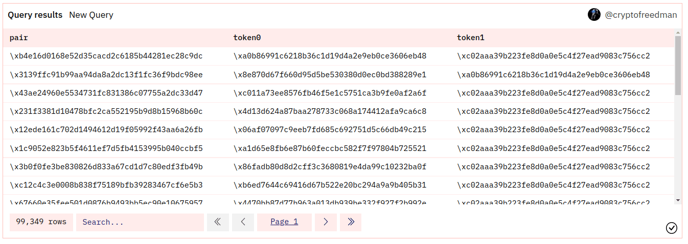
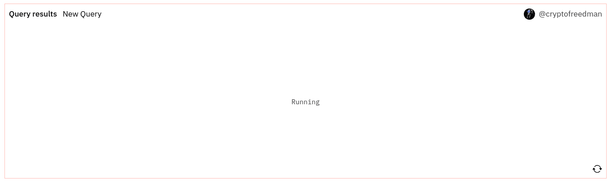

您在查询结果部分可以看到您的查询运行后返回的数据。

要想得到您的第一次查询结果，请按下查询窗口下面的橙色方框中的那个 Run【运行】按钮：

短暂时间过后，您的查询结果会以数据表形式 🪄 出现：

在您的结果表上方，您会发现：
  
  1. "Query Results"【查询结果】标签页；如果您做了更多的可视化内容，它们会作为标签页出现在这个标签页旁。
  2. New Visualization【新可视化】按钮，使您通过查询数据制作新的[可视化](../../features/visualizations/) 内容。
  3. "Last run"【上次运行】和 "Last run took"【上次运行时长】让您知道您的结果数据有多新鲜，以及您再次运行可能需要的时间的参考点（可能更多或更少，取决于您如何修改您的查询）。
  4. Run【运行】按钮（让您在修改查询后重新运行您的查询）。

### 保存您的查询

在运行您的查询至少一次后，您会在查询窗口上方看到 Save 按钮：

点击它可以看到一个弹出窗口，要求您给您的查询命名，并可以选择将这个查询设为私人查询（*~如果~*您是 [Dune Pro](../../features/pro.md) 的用户）：

在初次保存过后，在查询窗口上方您会找到：

1. Star【标星】按钮，让您看到您的查询有多少星星，也可以给自己标星。
2. Embed【嵌入】按钮，让您和他人在其它网页上嵌入该查询。
3. Fork【分叉】按钮，让您和他人创建一个该查询的副本，以便根据自己需要修改内容。💖 

在任何时候您做进一步的修改，Run【运行】按钮将变成一个 Save and run【保存并运行】按钮：

这将运行您可能猜到的事情（保存您的修改并重新运行您的查询）。

### 重新运行您的查询

当您重新运行您的查询时，您的结果表将是空白的，直到新的数据准备好并被加载：

Run【运行】按钮将会变成展示：

1. 您的查询运行了多久
2. 一个 Cancel【取消】按钮（万一您厌倦了等待！）

### 结果数据表排版

您可以通过数据表下面的选项来改变查询结果表格的格式和外观。

我们这有什么？👀

1. Add to dashboard【添加到看板】按钮在您[保存您的查询](#saving-your-query)之前不会起作用。在这里了解更多关于[制作看板](../../features/dashboards.md)的信息。
2. 一个改变您数据表标题的栏目。
3. 针对您每一栏的设置。

栏目设置是简单直接的：

- Title【标题】让您更改栏目标题
- Align【对齐】让您对齐每一栏数据的文本
- Format【格式】让您更改数字的格式，更多介绍见下面 👇。
- Hide column【隐藏栏目】将该列从您的表的显示中移除
- Colored positive values【正值上色】使您列的正值变成绿色.
- Colored negative values【负值上色】 使您列的负值变成红色.

列号的格式也遵循这个逻辑：

| 数值        | 数字格式 | 输出      | 介绍                               |
| ------------ | ----------- | --------------- | ----------------------------------------------------------------------------------------------------------------------------------------------------- |
| 1256784.3745 | 空白  | 1256784,3745000 | 显示完整数字和七位小数    |
| 1256784.3745 | 0           | 1256784         | 只显示整数                                                                                                                            |
| 1256784.3745 | 0,0         | 1,256,784       | 只显示带有逗号分隔符的整数                                                                                                      |
| 1256784.3745 | 0,0.00      | 1,256,784.38    | 根据小数点后的零的数量显示相应带小数点的数值                                                                |
| 1256784.3745 | 0\[.]0a     | 1.2m            | 
以缩略格式显示数值。

将根据小数点后的零的数量显示缩略数的小数。
 |
| 1256784.3745 | $0\[.]0a    | $1.2m           | 遵守与之前相同的方法，但增加了一个 $ 前缀。                                                     |

### 可视化

要把查询结果做成可视化，首先要做的是，您猜对了，就是猛按下 New Visualization  按钮 (如果您愿意，正常的点击也是可以的）。

然后查看我们的[可视化](../../features/visualizations/)文档，学习如何创造 📊 奇迹！