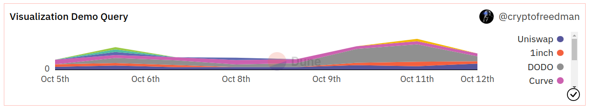
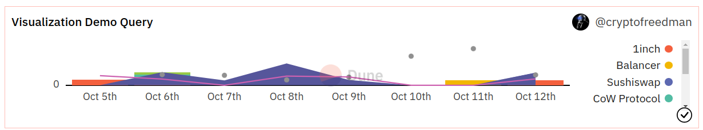

图形是将数据点浓缩为一个可视化的好办法。

通过 Dune，您可以创建以下类型的图形：

=== "柱状图"

    

=== "区域图"

    

=== "散点图"

    

=== "线状图"

    

=== "饼状图"

    

=== "混合图"

    只要您的基础图不是饼状图，您就可以在一个可视化中混合所有这些图形类型：

    

所有的可视化图形都有一套共同的编辑选项，请看下面的选项标签，了解如何配置每个选项。

## 可视化配置选项

=== "图表选项 (Chart options)"

    本节允许您定义如何显示您的数据。

    

    **标题（Title）**

    * 标题将出现在该图的所有实例的顶部显著位置。
    * 图形将始终保持查询的名称，即使您编辑它。

    **显示图例（Show chart legend）**

    * 勾选此框将启用或禁用图表的图例。

    **启用堆叠（Enable stacking）**

    * 如果适用，勾选此框将根据 X-轴 的值将图表的值堆叠在一起。
    * 如果没有开启，这些值将被单独绘制在 Y-轴 上。
    * 支撑这个计算的将总是把 X-轴 上的一个值对应的数值分组。请确保您的数据是干净的，这样才能发挥作用（避免您的数据出现空隙）。

    **归一化为百分比数据（Normalize to percentage data）**

    * 这将使图表归一化以显示所选数据表的百分比值。
    * 支撑这个计算的将总是把 X-轴 上的一个值对应的数值分组。请确保您的数据是干净的，这样才能发挥作用（避免您的数据出现空隙）。

    **显示数据标签（Show data labels）**

    * 勾选此框，就可以在图中显示各个数据点。
    * 这只有在您的数据点很少，而且相互之间分布得很远，不会重叠的情况下才有意义。

=== "结果数据（Result data）"

    在这里您可以挑选要显示的数据点。

    

    您可以选择一个 **x-轴 **和多个 **y-轴**。

    另外，您也可以在 Y-轴 上选择一个数据序列，并选择按数据表的不同列进行分组（如上例所示）。

=== "X-轴选项（X-axis options）"

    使用这些选项，您可以影响您的 X-轴 数据的显示方式。

    

    **轴标题（Axis title）**

    * 这个栏目允许您为您的 X-轴 指定一个标题。

    **排序值（Sort Values）**

    * 通过勾选此框，您可以指定是否要对图表中的数值进行排序。
    * 如果您的 X-轴 是一个时间序列，这将自动发生。

    **倒序值（Reverse value）**

    * 勾选此框将反转 X-轴 上数值的顺序。

    **对数化（Logarithmic）**

    * 勾选此框将使您的 X-轴 数值以对数方式显示。

=== "Y-轴选项（Y-axis options）"

    通过这些选项，您可以影响您的 X-轴 数据的显示方式。

    

    **轴标题（Axis title）**

    * 这个栏目允许您为您的 Y-轴 指定一个标题。

    **对数化（Logarithmic）**

    * 勾选此框将使您的 X-轴 数值以对数方式显示。

    **启用右侧 Y-轴（Enable right y-axis）**

    * 勾选此框将启用一个额外的 Y-轴，您可以在上面绘制数值。
    * 您可以在[图表序列部分](charts-graphs.md#ordering-your-series)里面选择您想在左和右轴上显示什么。

=== "序列选项（Series options）"

    

    在可视化编辑器的这一部分，您可以最终确定您的图形。

    * 您可以通过点击栏目重命名序列（series）。
    * 您可以通过点击下拉菜单来改变图表类型。
    * 您可以通过点击颜色框来改变颜色。
    * 最后，您还可以改变序列的顺序。

    **选择颜色**

    您可以用您的浏览器本地颜色选择器来挑选颜色。

    这对您来说可能略有不同，取决于您使用的浏览器。

    

=== "饼状选项（Pie options）"
    
    
    
    **标签格式（Label format）**

    * 这个栏目允许您定义您饼状图里面的数字标签的[刻度格式](#xy-axis-tick-and-label-formats)。

***

## X/Y-轴 刻度和标签格式（X/Y-axis Tick and Label formats）

刻度格式改变了图形中数值和轴标签的显示方式。

这是更改它们格式的方法：

| 起始值       | 刻度/标签格式 | 输出          | 说明                                                                                                                                           |
| ------------ | ----------- | --------------- | ----------------------------------------------------------------------------------------------------------------------------------------------------- |
| 1256784.3745 | `[blank]`  | 1256784.3745000 | 显示数字的小数点后 7 位精度。                                                                                                               |
| 1256784.3745 | `0`           | 1256784         | 只显示整数。                                                                                                                            |
| 1256784.3745 | `0,0`         | 1,256,784       | 只显示用逗号分隔的整数。                                                                                                   |
| 1256784.3745 | `0,0.00`      | 1,256,784.38    | 显示具有 [x] 小数点精度的数字，其中 [x] 是您在小数点后面添加的 `0` 的数量。                                                                |
| 1256784.3745 | `0.0a`     | 1.2M            | 
显示具有 [x] 精度的数字和基于该数字 1e[y] 幂的字母（例如，"m" 表示百万，"b" 表示十亿）。  |
| 1256784.3745 | `$0.0a`    | $1.2M           | 在数字上添加一个 "\$"。可用于上述所有格式，但建议使用 `a` 后缀。目前只有 "\$" 是唯一支持的货币符号。                                                                                                           |