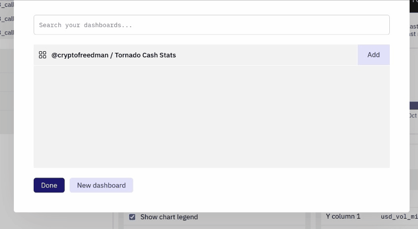

随着您通过[查询](../../features/queries/)收集和组织区块链数据，现在是时候用可视化增加一点 ✨ 了。

有了 Dune，您有多种方法可以将您的查询数据转化为可视化数据：

[**图表可视化**](charts-graphs.md)

* 柱状图
* 区域图
* 散点图
* 线状图
* 饼状图

[**其它可视化**](other-visualizations.md)

* 计数器
* 表格

以一种周到的方式将这些结合起来，使您能够将您的数据通过[看板](../../features/dashboards.md)和[嵌入](../sharing/embeds/index.md)以最好的方式传达给您的受众。

## 创建可视化内容

您可以使用 Dune 的可视化引擎在几秒钟内从任何查询结果中创建可视化内容。

要开始使用，请点击 New Visualization 按钮：

然后您会看到一个下拉菜单出现，上面列出了可用的可视化类型。选择您想要的类型，然后点击 Add visualization 按钮来创建您的可视化：

您可以通过重复上述步骤，从一个查询中创建多个可视化（以测试哪个效果最好或揭示不同的见解）：

**在此阅读更多关于每种可视化类型如何运作的信息：**

- [图表 & 图形](charts-graphs.md)
- [计数器 & 数据表](other-visualizations.md)

## 分享可视化

当您创建了一个满意的可视化，您可以在[看板](../dashboards.md)上与他人分享，或使用[嵌入](../sharing/embeds/index.md)功能将其嵌入另一个网站上。

### 将可视化添加至看板

点击 Add to dashboard 按钮添加可视化至[看板](../dashboards.md)：

然后点击您现有的一个看板旁边的 Add 按钮：

 或者创建一个新的看板，并像这样将您的可视化添加到其中：
 
 1. 点击 New dashboard 按钮
 2. 添加名称
 3. 点击 Save dashboard 按钮
 4. 点击您新看板旁的 Add 按钮

要查看您添加可视化的看板，点击弹出窗口中的名称：

当您在可视化内容中做了更改时，它也将在您的看板上更新：

要从看板中移除一个可视化内容，请点击 Added 按钮：

### 创建可视化嵌入

要从您的可视化中创建一个[嵌入](../sharing/embeds/index.md)，首先选择您希望嵌入的可视化内容，然后点击[数据浏览器](../../features/queries/data-explorer.md)上方的 Embed 按钮：

