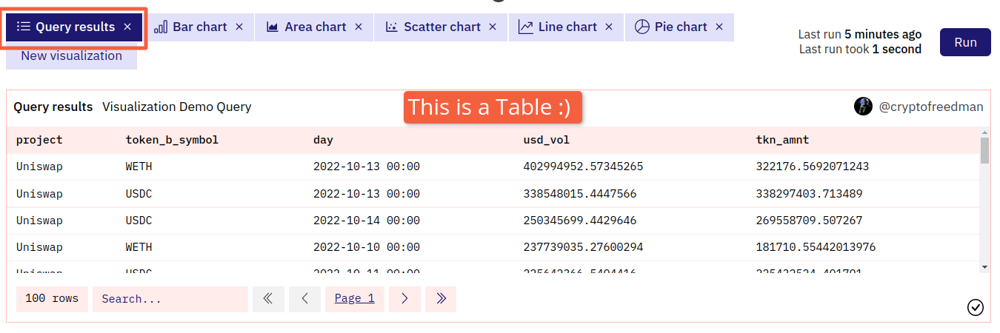
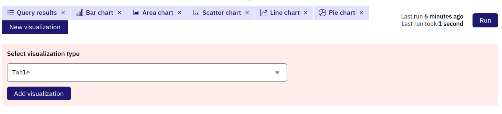

下面是一些您可以用 Dune 制作的非图形可视化内容!

## 数据表

数据表是默认的可视化，每当您创建和运行一个查询时，您会发现标有 Query results 的表格：

您还可以使用 New visualization 按钮和下拉菜单制作更多的数据表，以不同的方式显示您的数据：

### 配置您的数据表

#### 数据表选项（Table options）

**标题（Title）**

标题显示在您数据表格的上方。

保留默认值（`Table`）或将其设为空白，使您的表标题与查询的标题/名称相同。

在这个栏目中添加任何其他值，都会先添加该值，然后是您的查询名称：

注：默认值 "Query Results" 被视作一个添加值。

#### [x] 列的选项（Column [x]） 

您可以为您的数据表中的每一列配置以下选项

=== "标题（Title）"

    标题出现在数据表的顶部。

    将此留空使您的列标题与您的 Dune 数据库名称相同。

=== "对齐（Align）"

    这将改变列的数据和标题的文本对齐方式。

=== "更改格式（Format）"
    
    允许您在这里按照 [X/Y-轴的刻度和标签格式](../visualizations/charts-graphs.md#xy-axis-tick-and-label-formats)调整数据的数字格式。

=== "隐藏列（Hide Column）"

    从您的数据表中隐藏这一列。

***

#### 数值列选项（Numerical Column options）

返回数字数据的列有这些附加选项：

=== "类型（Type）"

    - `Normal` 只显示该列的数字数据。
    - `Progress bar` 用一个进度条的视觉效果显示该列的数字数据，该列的最高值为"满"，最低值为"接近空"，其余的数据介于两者之间：

    

=== "带色数值（Colored Values）"
    
    勾选 Positive Values Green 和 Negative Values Red 的框给数值上色。

***

## 计数器

计数器是为您的受众提供即时“一目了然”的统计数据的一个好方法。

### 配置您的计数器

#### 计数器选项

在这一部分，您可以定义计数器应该显示什么样的数据：

=== "标题（Title）"

    * 标题将出现在该图的所有实例的顶部，非常明显
    * 如果此处留空白，将默认显示查询名称

=== "列（Column）"

    * 在此栏目您可以定义计数器应该显示哪一列。

=== "行（Row）"

    * 此栏可以用来定义您想显示的基础数据表的哪一行，例如第 1 行。
    * 通常这需要您对查询结果进行排序或限制，以使第 1 行显示所需的结果。

***

#### 更改格式（Formatting）

在这一部分，您可以调整您的数字数据显示方式。

=== "前缀（Prefix）"

    * 此栏目允许您为您的计数器值定义一个前缀。
    * 例如：`$`、`€`、`Ξ`、`฿`

=== "后缀（Suffix）"

    * 此栏目允许您为您的计数器值定义一个后缀。

=== "标签（Label）"

    * 此栏目允许您为您的计数器值定义一个标签。
    * 标签将以文字形式显示在计数器数值下方。

=== "小数（Decimals）"

    * 在此栏目中，您可以选择您想要在计数器上显示多少位小数。
    * 目前限制为小数点后 3 位。

***

