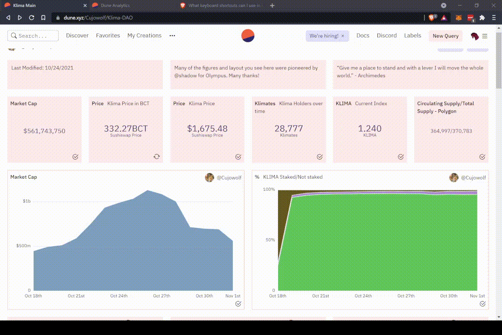

**截图是无趣和过时的**

为了使您不必拍摄可能看起来不那么好，但在您拍摄几分钟后肯定会过时的屏幕截图，我们已经建立了一个原生的嵌入功能，可以在大多数网络平台上使用。

您可以通过点击任何查询标题并选择右上角的嵌入功能来生成嵌入链接。

!!! 注意
    嵌入按钮既可以作为一个独立的链接，也可以作为一种将您的实时图表嵌入到网站/应用程序的方式。如果一个查询没有被可视化，该链接将指向查询结果表。如果您有多个可视化内容，链接将是您点击嵌入按钮时选择的任何一个可视化内容。

## 在不同平台上嵌入

### Twitter

Twitter会自动渲染和更新 Dune 的可视化内容!

只需粘贴您的嵌入链接，就可以轻松实现. 🪄

### Discord

Discord 可以很好的支持Dune的嵌入，您只需在聊天框里发送链接，相应的可视化内容就会被展示。

这也很适合对机器人进行编程，使其根据命令返回相应的图表。

### 网页嵌入

您可以使用Dune的嵌入链接加上 `iframe` 来将实时可视化内容添加到任何网页上。

以下是一段代码示例:

`<iframe src="https://dune.com/embeds/208941/391702/2cbe40da-a0e4-43ac-896b-fef6d4d9fda7" height="500" width="500" title="chart 1"></iframe>`

这是有一个很好的示例 [cryptoart.io](https://cryptoart.io/data) 网站.

### Mirror.xyz

只需生成一个嵌入链接，并在后面加上 `?display=iframe`，Dune 的可视化内容就可以可以很容易地被嵌入到 mirror.xyz 的文章中。

示例:

`https://dune.com/embeds/208941/391702/34ee3319-1cac-40e1-a08d-160bd93693cc?display=iframe`

### 已知问题

遗憾的是，下面这些网站目前还不支持Dune的嵌入。

* Substack
* Medium
* GitBook

## 参数化嵌入

嵌入链接也可用于参数化查询，但是需要一些技巧：

生成的嵌入链接并不包含必要的参数，尽管查询已经被执行过。

我们正在努力使之自动化，但目前您仍需在参数链接中手动添加参数前缀：

`link?[name_of_parameter_1]=[xxxx]&?[name_of_parameter_2]=[yyyy]&[...]`

示例:

`https://dune.com/embeds/118220/238460/aa002dd3-f9e2-4d63-86c8-b765569306c6NFT?address=0xff9c1b15b16263c61d017ee9f65c50e4ae0113d7&rolling_n_trades=500`
