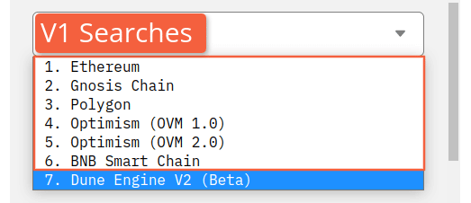
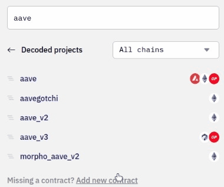
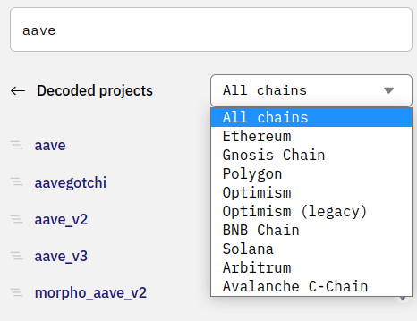

数据浏览器使您能够搜索区块链和其他数据，以便在您的查询中使用（在[数据表部分](../../reference/tables/index.md)了解 Dune 提供的所有数据）。

要找到您要找的数据，首先选择您要搜索的数据库：

然后只需在顶部的搜索栏中输入任何关键词、协议名称、合约名称或事件名称。

这将带来一个包含区块链数据的[数据表](../../reference/tables/index.md)列表，您可以将其用于您的查询！🧙

## 使用数据浏览器搜索

如果您在下拉菜单中选择了可用的区块链数据库之一，请看下面的 V1 标签。

如果您选择了 Dune 引擎 V2 (beta) 数据库，请看 V2 标签。

=== "V2"

    ## V2

    !!! warning
        像所有的 Dune V2 一样，V2 数据浏览器仍处于测试阶段。所以它的功能可能与这里描述的略有不同，因为我们正在积极测试和迭代，以使它变得更好！如果您有关于如何使 V2 浏览器运行得更好的建议，请[在我们的反馈板上添加它](https://feedback.dune.com/)！如果您对如何使这些文档变得更好有建议，请在[本页面的 Github](https://github.com/duneanalytics/docs/edit/master/docs/features/queries/data-explorer.md) 上进行编辑并提交一个 Pull Request！

    在 [Dune V2](.../.../dune-v2/) 中最大的变化之一在于我们的数据结构——不再将数据按区块链隔离到不同的数据库中，而是在一个数据湖中访问一切。

    您会在您的查询中体验到这种变化的力量——通过 V2，您可以在一个 SQL 查询中纳入来自多个链的数据！

    另一个改进是在数据浏览器中。

    要开始探索 Dune V2，请从下拉列表中选择它，而不是选择一个单独的链：

    

    在这里您会发现一个搜索栏，可以搜索 Dune V2 里面的所有数据和 4 个不同类别的数据集：

    1. [**原始**](../../reference/tables/raw.md) —— 就像它听起来那样，直接来自区块链的原始数据
    2. [**已解析项目**](../../reference/tables/decoded.md) —— Dune 团队和社区的项目的合约调用和事件已被整理成不错的人类可读的数据表
    3. [**魔法**](../../reference/tables/spells.md) —— 标准化的项目和行业数据 (dex.trades, nft.trades, erc20.stablecoins, 等)
    4. [**社区**](../../reference/tables/community.md) —— 由 web3 社区提供的链下数据

    
    
    ### Dune V2 搜索

    当您在主页上使用关键词进行搜索时，您将会搜索整个 Dune V2 —— 当您不太确定您在寻找什么时，这对于探索所有可用的数据是非常棒的。

    !!! note
        Dune V2 浏览器不区分大小写

    然而，由于浏览器需要通过所有这些数据来寻找与您的关键词相匹配的数据，这些搜索也会有最长的等待时间。

    因此，如果您知道您正在寻找上面列出的特定类别中的数据，请点击进入该类别，并在那里进行搜索，以获得更好的速度！
    
    请记住，当您在 V2 数据浏览器内搜索一个特定的数据集时，您将只找到该数据集内的数据。

    例如，如果我们在主层搜索 Aave，我们会找到所有的已解析表以及与 Aave 有关的魔法：

    

    然而，如果我们点击进入原始数据集，我们不会发现任何东西，因为这将我们的搜索仅仅限制在原始区块链数据：

    

    这个功能是递归工作的 —— 当您离开 V2 主搜索栏时，您的关键词搜索仅限于您目前所处的特定数据集级别。

    为了查看这个功能是如何工作的，让我们先点击进入已解析项目，在那里搜索 Aave：

    

    在这里，我们找到了在其名称中包含 Aave 的协议，以及 Aave 本身不同的版本（就像协议会将合约组发布为 v1、v2 等版本一样，我们在已解析项目中以这种方式对数据进行分组，以使内容像在链上一样有条理）。

    点击 `aave_v2` 进到下一层，我们会看到所有与 Aave v2 版本相关的合约：

    

    看到 `AaveEcosystemReserve` 合约了吗？

    让我们通过点击顶部的 `aave v2`，向后退一层：

    

    然后在此尝试搜索 `AaveEcosystemReserve`： 

    

    正如您所看到的，由于我们比 `AaveEcosystemReserve` 所在的深度高一级，所以没有返回结果。

    如果我们再往下探，同样的事情也会发生！

    点击进入 AToken 合约，我们会发现该合约中包含的所有函数和事件：

    

    但如果我们试着在此搜索 `AaveEcosystemReserve`。。。

    

    运气不佳。

    同理，如果我们点击回到 `aave_v2` 协议版本层，其包含所有 Aave v2 合约，并搜索存在于 `AToken` 合约中的 `approve` 函数：

    

    我们不会得到任何结果。

    最后，您可能已经注意到，原始数据集、已解析项目和魔法数据集都可以通过 `All chains` 或特定链进行搜索。

    正如我们所看到的，如果您用这个下拉菜单限制您的搜索，您既能更快地得到结果，又不会从其他链上找到结果。

    

    最后，您可以在智能合约中搜索某些数据表的类型，例如 `function` 和 `event`，也可以使用下拉菜单：

    

    或者使用搜索框在 `function` 或 `event` 中寻找某些数据类型:

    

    ### 图标和标签

    首先，只要您看到一个双箭头 `>>` 图标，您就可以点击它们，将该数据表或数据点名称添加到您的查询中：

    
    
    我们试着通过使用图标和标签来使得 V2 搜索更加 ✨：

    1. 魔法、协议合约集或单独合约属于哪个区块链。
    2. 一部分数据/数据集是魔法、已解析合约或社区数据集（其中包含多个数据表），或是一个单独的表。
    3. 已解析合约中的数据表是否是一个函数或事件。
    4. 一个魔法集是针对项目还是行业。
    5. 一部分数据是什么类型。

    以下是这一切的含义：

    #### 区块链图标

    有些数据集会有多个区块链图标——这意味着在该数据集内可以获得来自每个区块链的数据！

    | 图标      | 说明                          |
    | ----------- | ---------------------------------------- |
    |        | Ethereum 区块链原始数据、已解析项目或魔法|
    || Gnosis 链原始数据、已解析项目或魔法|
    |  | Polygon 区块链原始数据、已解析项目或魔法|
    |  | Optimism 区块链原始数据、已解析项目或魔法|
    |  | Optimism (legacy) 区块链 原始数据、已解析项目或魔法|
    |  | BNB 链原始数据、已解析项目或魔法|
    |  | Solana 区块链原始数据、已解析项目或魔法|
    |  | Arbitrum 区块链原始数据、已解析项目或魔法|
    |  | Avalanche C-链原始数据、已解析项目或魔法|
    
    在合约/数据集旁边的图标与区块链名称不同的情况下，图标是该数据所处的区块链。例如，这些是 Ethereum 链上的 Polygon 桥合约。

     

    #### 数据集图标

    | 图标      | 说明                          |
    | ----------- | ---------------------------------------- |
    |  | 数据表（原始数据、魔法或智能合约事件或函数）|
    |  | 已解析项目（协议或协议版本，如 "opensea" 或 "aave_v2"） |
    |  | 魔法集（例如 cow_protocol 包含 "batches" 和 "solvers" 魔法） |
    |  | 社区数据集 |

    #### 数据集标签

    | 标签      | 说明                          |
    | ----------- | ---------------------------------------- |
    | `project` | 一个特定项目的魔法集，如 `aave` |
    | `sector` | 一个特定板块的魔法集，如 `dex` |
    | `event` | 一个智能合约事件数据集 |
    | `function` | 一个智能合约函数数据集 |

    #### 数据类型标签

    您可以在此找到完整的 [Databricks SQL 数据类型文档](https://docs.databricks.com/sql/language-manual/sql-ref-datatypes.html)。对于那里没有的类型，请在此参见 [Apache Spark SQL 数据类型](https://spark.apache.org/docs/latest/sql-ref-datatypes.html)。

    | 标签      | 说明                          |
    | ----------- | ---------------------------------------- |
    | `string` | 大于或等于 0 的任何长度的字符序列。|
    | `long` |  代表 8 字节的有符号整数。数字的范围是从 -9223372036854775808 到 9223372036854775807。 |
    | `integer` | 代表 4 字节的有符号整数。数字的范围是从 -2147483648 到 2147483647。|
    | `boolean` | 代表布尔（boolean）值。(TRUE/FALSE) |
    | `date` | 代表由年、月、日字段的值组成的数值，不含时区。  |
    | `timestamp` | 代表由年、月、日、时、分、秒等字段值组成的数值，与会话的当地时区有关。时间戳值代表一个绝对的时间点。 |
    | `decimal({{p}},{{s}})` | 代表具有指定最大精度（p，1-38）和固定比例（s，小数点右边的数字数，0-p）的数字。|
    | `array<{{xx}}>` | 一个 `{{xx}}` 的数据数组. (`long`, `string`, 等) |

=== "V1"

    ## V1

    ### 通过关键字搜索

    仅仅搜索 `uniswap` 就会出现所有以某种形式包含关键字 `uniswap` 的数据表。

    

    使用空格创建多关键词搜索。

    

    ### 寻找特定架构

    搜索 `uniswap_v2.` 就会出现所有特定与 `uniswap_v2` 架构相关的数据表。

    在 Dune 的 V1 引擎中，在末端添加 "."，说明您在寻找这个确切的数据表的架构中的数据。如果没有 "."，您也会找到很多数据，包括引用，在这个例子中，`uniswap_v2.`。    

    

    ### 寻找事件、调用或合约

    搜索 `uniswap_v2. evt` 就只会出现所有与 `uniswap_v2` 架构相关的事件表。

    同理，`call` 会调取调用，并且搜索一个特定的 `{{contractName}}` 会带出该合约的所有数据。

    

    ### 寻找特定合约数据

    点击一个数据表的名称，可以看到该合约表内的所有列的列表：

    

    ### 在查询窗口中添加引用

    点击数据表名称旁的 `>>` 添加合约数据表的引用：

    

    点击数据名称引用数据表内的指定数据：

    

