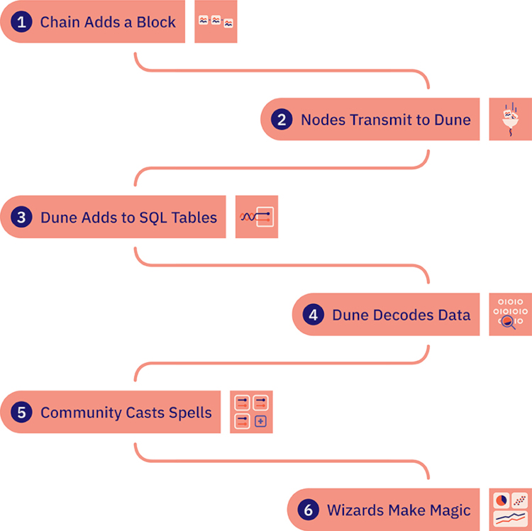

Dune 是一个强大的区块链研究工具，配备了您需要的所有工具，以发现、探索和可视化大量区块链数据。

 Dune 是您解答问题的关键，比如：

- [Uniswap 每天经手多少交易量？](https://dune.com/queries/3)
- [哪个 Dex 有最高的交易量？](https://dune.com/queries/1847)
- [重要的稳定币今天表现如何？](https://dune.com/hagaetc/stablecoins)

## 5 分钟 Dune 简介 ⚡

## 数据是如何流通的

公共区块链是[公开且免费](https://dune.com/blog/revolution-not-quarterly)的，所以从中获取数据应该不难对吧？

是也不是。

与从传统企业获得孤立的数据相比，比如，分析国际运输速度如何影响消费者对最新巴黎时装的需求……

是的，查看和分析区块链数据是 "更容易"。

但是，在 Dune 的用语里持续地有新东西。让我们打开它看一看，以更好地了解像以太坊这样的公共区块链上的状态变化如何转化为您查询的数据，以建立图表和图形。

###   1. 在一条链上添加一个区块

虽然技术细节各不相同，但每个区块链的核心，都会提出一组交易，达成一致，然后附加到包含先前确定的交易的区块链的末端。

有各种[共识机制](https://crypto.com/university/consensus-mechanisms-in-blockchain)，确定哪个区块是下一个区块的方法，但一旦达成共识，关于最新区块的信息就会在区块链的网络中广播，让其参与者（“节点”）知道这个新区块并将其加入他们的记录。

[请看这个超棒的区块链 101 演示](https://andersbrownworth.com/blockchain/)，了解更多关于区块链机制的细节！

###  2. 节点提供者将数据传输给 Dune

为了接收这个“新区块创建”的信息，有人必须运行一个[区块链节点](https://www.alchemy.com/overviews/what-is-an-ethereum-node) —— 一个运行“客户端”软件的计算机，将他们连接到区块链的网络，允许他们在其他节点之间来回发送信息，并在某些情况下验证交易和存储数据。

只要有一点技术诀窍，任何人都可以运行一个节点——这是使区块链 _公共_ 的一个重要部分！

因为几乎任何人都可以运行一个节点，所以系统中有很多的透明度，以保持参与者的诚实。

这种透明度也使其有可能通过允许数据分析师访问“正在发生的事情”的完整画面来利用蜂巢式思维，并做他们想要的任何类型的分析。

不需要为访问原始数据而挣扎。

为了帮助像 Dune 这样的项目规模化运作，[节点提供者](https://www.alchemy.com/overviews/blockchain-node-providers)建立和运营节点基础设施，捕获区块链数据，并通过应用编程接口（API）使其能够被我们访问。

通过这种方式，我们可以专注于创造最佳的数据访问体验，而节点供应商可以专注于尽可能有效地运行节点。

###  3. Dune 将原始数据添加到 SQL 数据表

我们的节点供应商将区块链交易数据作为哈希字节码发送给我们（例如，以太坊数据是使用 [keccak256 算法](https://medium.com/0xcode/hashing-functions-in-solidity-using-keccak256-70779ea55bb0)进行哈希的。）

Dune 数据引擎接收这个字节码并将其提取为一组我们称之为“[原始数据](https://dune.com/docs/tables/v2/raw/)”的表。

这些可能因链而异，但作为例子，大多数基于[以太坊虚拟机（EVM）](https://dune.com/docs/tables/v2/raw/ethereum-mainnet/creation-traces/)的链包括：

* [[chain].blocks](https://dune.com/docs/tables/v2/raw/ethereum-mainnet/blocks/) - 附加到链上的交易组
* [[chain].creation_traces](https://dune.com/docs/tables/v2/raw/ethereum-mainnet/creation-traces/) - 包含[`create` traces](https://medium.com/coinmonks/ethereum-data-evm-traces-simplified-5e297e4f40a4) 的交易 （有时它们会在内部交易里）
* [[chain].logs](https://dune.com/docs/tables/v2/raw/ethereum-mainnet/event-logs/) - 智能合约创建的[事件日志](https://medium.com/mycrypto/understanding-event-logs-on-the-ethereum-blockchain-f4ae7ba50378)
* [[chain].traces](https://dune.com/docs/tables/v2/raw/ethereum-mainnet/traces/) - 一个区块中的交易产生的[追踪数据](https://medium.com/coinmonks/ethereum-data-evm-traces-simplified-5e297e4f40a4)
* [[chain].transactions](https://dune.com/docs/tables/v2/raw/ethereum-mainnet/transactions/) - 从一个地址发送到另一个地址的经过加密签名的指令

这些表中的数据是人类可读的（而字节码不是），但它们需要广泛的区块链知识来理解。

这种原始数据也可能需要更多的工作来处理成有趣的见解，这就是为什么 Dune [解析](https://dune.com/docs/tables/decoded/)这种数据。

###  4. Dune 解析原始数据

原始 `.log` 数据表返回的数据像这样：

| Field   | Data                                                                 |
| ------- | -------------------------------------------------------------------- |
| tx_hash | `0x2bb7c8283b782355875fa37d05e4bd962519ea294678a3dcf2fdffbbd0761bc5` |
| topic1  | `0xddf252ad1be2c89b69c2b068fc378daa952ba7f163c4a11628f55a4df523b3ef` |
| topic2  | `0x00000000000000000000000075e89d5979e4f6fba9f97c104c2f0afb3f1dcb88` |
| topic3  | `0x00000000000000000000000087d9da48db6e1f925cb67d3b7d2a292846c24cf7` |
| data    | `0x00000000000000000000000000000000000000000000001a894d51f85cb08000` |

这种形式的数据的分析相当有限。

为了将这些数据转化为更可用的形式，[巫师在此提交智能合约进行解析](https://dune.com/contracts/new)。

当这种情况发生时，我们使用智能合约的[应用二进制接口（ABI）](https://www.alchemy.com/overviews/what-is-an-abi-of-a-smart-contract-examples-and-usage)，这类似于 Web 2.0 的 API，以了解与合约互动的交易内部发生了什么。

然后我们创建[已解析表](https://dune.com/docs/tables/decoded/)，这样做分析起来就容易多了。

例如，上述交易，一旦被解析，看起来是这样的：

| Field       | Data                                                                 |
| ----------- | -------------------------------------------------------------------- |
| evt_tx_hash | `0x2bb7c8283b782355875fa37d05e4bd962519ea294678a3dcf2fdffbbd0761bc5` |
| "from"      | `0x75e89d5979e4f6fba9f97c104c2f0afb3f1dcb88`                         |
| "to"        | `0x87d9da48db6e1f925cb67d3b7d2a292846c24cf7`                         |
| value       | `489509000000000000000`                                              |

###  5. Dune 社区在施法

在我们很棒的社区巫师的帮助下，Dune 不仅仅是用[魔法](https://dune.com/docs/tables/spells/)对数据进行解码。

魔法是由 Dune 和我们的社区建立和维护的自定义表格，它使我们能够以尽可能少的摩擦轻松地汇总大量的数据。

例如，最受欢迎的魔法之一，[nft.trades](https://dune.com/spellbook#!/model/model.spellbook.nft_trades)，使探索和转换跨协议和跨区块链的 NFT 交易数据变得很容易，而不必自己从 Solana 的 Magic Eden，以太坊的 LooksRare 等编译交易。

###  6. Dune 巫师创建魔法

从这些数据中，巫师使用 SQL（一种广泛使用的语言，用于存储、操作和检索数据库中的数据）创建[查询](getting-started/queries/index.md)。 

从这些查询中，他们创建我们都知道并喜爱的[可视化内容](getting-started/visualizations/index.md)和[数据看板](getting-started/dashboards.md)！

例如 [@rchen8](https://dune.com/rchen8) 的 OpenSea 日交易量：

## 和 dune.com 一起制作 🪄 

Dune.com 是建立在 Dune 数据平台之上的第一个杀手级应用，旨在让任何至少有一点 SQL、以太坊虚拟机和商业知识的人尽可能容易地以有趣的方式分析区块链数据。

Dune.com 应用程序的基本构成部分是：

- **数据看板：**一组包含可视化和文本的小部件，讲述了一个关于特定区块链数据组的故事。
- **可视化：**图表和图形，将难以理解的数据表形式的数据变成更容易理解的视觉形式。
- **查询：**从Dune的数据库中提取数据的命令，以便通过数据表和可视化显示在 Dune 看板中。

作为一名 Dune.com 的访问者，您会看到包含文本、数据表和可视化部件的看板，这些部件是由查询组建的。

作为一名 Dune 巫师（即比“区块链分析师”更酷的称呼），您将创建自定义查询来获取数据，将这些查询的结果可视化，然后用您的数据通过看板讲述故事。

### 查询

Dune 将区块链数据汇总到一个可以轻松查询的 SQL 数据库中。

[查询](getting-started/queries/index.md)是用来指定在我们的数据库中找到区块链的哪些数据并返回。

也许您想知道 _今天发生的所有 Dex 交易_，或者 _今年铸造的稳定币的总价值_。不管是什么问题，探索答案都要从 Dune 查询开始！

查询返回数据的行和列（就像传统的 SQL 查询），然后可以用来创建可视化形式，并在看板上展示。

区块链分析师（即 巫师 即您！）有几种方法可以开始运行查询：

1. 最简单的方法是使用 Dune [_魔法_](reference/tables/spells.md)) 来查询常用的数据表格。一些流行的魔法包括 `dex.trades`, `lending.borrow`，和 `stablecoin.transfer`。
2. 查询原始以太坊数据，如区块、日志和交易。
3. 也可以查询中心化交易所的数据。如，您可以使用 `prices.usd` 来快速返回几乎所有加密资产的价格。

### 可视化

以表格形式呈现的数据（行和列）可能难以阅读。[可视化](getting-started/visualizations/index.md) 将查询的结果以一种清晰、精确和 _可视化_ 的方式呈现出来。

通过 Dune 可视化，您可以很容易地开始用您的数据讲述一个故事，通过这样的转换：

变成这样：

可视化的柱状图使人清楚地看到，4月19日的转移总价值最高，以帮助您和其他人看到一段时间内的趋势。

Dune 提供了各种可视化，您可以用它来直观地展示数据，包括：

- **柱状图**
- **区域图**
- **散点图**
- **线状图**
- **饼状图**
- **计数器**
- **数据表**

### 数据看板

使用精心策划的可视化内容，聪明的区块链分析师（巫师！）可以通过 [Dune 数据看板](getting-started/dashboards.md)讲述不同数据集合的故事。

例如，在下面看板中，[@hagaetc](https://dune.com/hagaetc) 创建的 [Dex Metrics](https://dune.com/hagaetc/dex-metrics)，在顶部可以清楚地看到 "DEX"（去中心化交易所）作为一个类别正在增长。在下面，访问者可以看到哪些 DEX 在交易量上最受欢迎，最后还可以看到一个堆叠的柱状图，显示随时间的变化。

仅仅通过查看这个单一的看板，任何人都可以清楚地了解整个 DEX 市场的情况。

## 如何浏览这些文件

我们已经建立了这些文档来回答您所有的问题，包括 who, what, when, where, why，以及如何处理任何/所有 Dune 的 问题！

下面是每个部分的简要介绍：

- [入门](getting-started/index.md) 是您了解方向并学习如何使用 Dune 的板块！
- [参考](reference/index.md) 是您可以得到 "谁、什么、哪里 "问题的答案，并找到我们收集的一些补充资料的地方。
- [魔法书](spellbook/index.md) 是您可以找到创建和使用魔法所需的一切的地方。
- [API](api/index.md) 是您可以找到将我们的 API 集成到您的项目中所需要的一切的地方。

如果您迫不及待地想用您的魔杖开始工作，请跳到我们的[查询快速入门](getting-started/query-quick-start/index.md)的演练中，这将帮助您建立您的第一个 Dune 查询!

## Dune 是一个社区的努力

在 Dune.com 上，所有的查询和数据集默认都是公开的（如果您需要对您的查询进行保密，我们的 [Pro 版本](https://dune.com/pricing) 可以满足您的要求）。

这使得您，巫师，可以轻而易举地分叉和混合组建其他创造者的查询，以建立在他们的知识和洞察力之上。

反过来说，您创建的每一个新查询，都会帮助其他人通过 Dune 学习关于区块链和加密资产的新知识。

这种积极的反馈循环是 Dune 社区如何通过不断增长的查询，让我们大家学习更多的东西而共同成功的！

加入我们的[社区 Discord](https://discord.gg/BJBHFR6sdy)，从我们的团队和社区获得世界级的支持。

查看我们的[活动日历](reference/events.md)，加入有趣的**现场活动**。

如果您有任何反馈，无论是功能要求还是错误报告，请[在此](https://feedback.dune.com)提交。
